<div align="center">

# Order Tracking

### Сервис отслеживания заказов с Kafka, outbox, SignalR и полноценной наблюдаемостью

REST API · Worker · PostgreSQL · Redpanda/Kafka · SignalR · React + Vite · OpenTelemetry · Prometheus · Grafana · Loki · VictoriaLogs · Jaeger

[](https://github.com/Ingaleee/Lab2/actions/workflows/ci.yml)
[](https://github.com/Ingaleee/Lab2/actions/workflows/codeql.yml)
[](https://dotnet.microsoft.com/)
[](https://react.dev/)
[](https://docs.docker.com/compose/)
[](https://www.postgresql.org/)

**Order Tracking** демонстрирует промышленный сценарий обработки заказов: API принимает команды, сохраняет данные в PostgreSQL, фиксирует интеграционные события через outbox, worker публикует события в Kafka, а API доставляет изменения клиентам через SignalR. Вся цепочка покрыта метриками, логами и трассировками.

</div>

---

## Содержание

| Раздел | Что внутри |
|---|---|
| [Назначение](#назначение) | какую задачу решает проект |
| [Архитектура](#архитектура) | слои, поток данных и основные компоненты |
| [Технологический стек](#технологический-стек) | backend, frontend, инфраструктура |
| [Быстрый запуск](#быстрый-запуск) | запуск через Docker Compose |
| [Порты и сервисы](#порты-и-сервисы) | адреса API, Grafana, Prometheus, Jaeger и других сервисов |
| [Рабочий сценарий](#рабочий-сценарий) | создание заказа, смена статуса, outbox, Kafka, SignalR |
| [API и SignalR](#api-и-signalr) | REST-эндпоинты и realtime-события |
| [Наблюдаемость](#наблюдаемость) | метрики, логи, трассировки и скриншоты |
| [Тестирование и CI](#тестирование-и-ci) | локальные проверки и GitHub Actions |
| [Документация](#документация) | дополнительные markdown-файлы проекта |

---

## Назначение

Проект моделирует систему отслеживания заказов. Пользователь или внешний клиент может создать заказ, получить список заказов, открыть карточку заказа и изменить его статус. Внутри системы каждое важное изменение проходит через надежную событийную цепочку:

1. API валидирует запрос и сохраняет изменения в PostgreSQL.
2. Вместе с бизнес-операцией создается запись в outbox.
3. Worker забирает необработанные outbox-сообщения и публикует их в Kafka.
4. API получает событие из Kafka и рассылает обновление подключенным клиентам через SignalR.
5. OpenTelemetry отправляет метрики, логи и трассировки в observability-стек.

Такой подход показывает, как строить сервис, который не теряет события при сбоях и при этом остается наблюдаемым: видно состояние API и worker, HTTP-нагрузку, работу БД, публикацию в Kafka, доставку SignalR и связь логов с trace/span.

---

## Архитектура

Решение разделено по принципам Clean Architecture: доменная логика отделена от инфраструктуры, API и фонового worker.

| Слой | Назначение |
|---|---|
| `OrderTracking.Domain` | доменная модель, статусы заказов, правила переходов, базовые сущности |
| `OrderTracking.Contracts` | DTO и интеграционные события, которыми обмениваются компоненты |
| `OrderTracking.Application` | сценарии приложения, абстракции репозиториев и сервисов |
| `OrderTracking.Infrastructure` | EF Core, PostgreSQL, Kafka, outbox, реализации внешних зависимостей |
| `OrderTracking.Presentation.Api` | REST API, Swagger/OpenAPI, SignalR, метрики и трассировки API |
| `OrderTracking.Presentation.Worker` | фоновая обработка outbox и публикация событий в Kafka |
| `frontend` | клиентское приложение на React/Vite для работы с заказами |

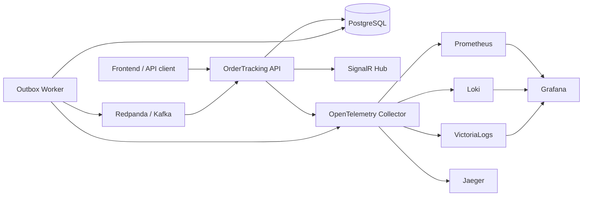

Ключевая идея проекта: бизнес-изменение и запись события происходят в одной транзакции БД, а публикация в Kafka выполняется отдельно. Благодаря этому событие не теряется, даже если broker или worker временно недоступны.

---

## Технологический стек

| Область | Технологии |
|---|---|
| Backend | .NET 9, ASP.NET Core, EF Core, NSwag, SignalR |
| Frontend | React 19, Vite, TypeScript, React Query, Axios, SignalR client |
| База данных | PostgreSQL 16 |
| Сообщения | Redpanda как Kafka-compatible broker |
| Observability | OpenTelemetry, Prometheus, Grafana, Loki, VictoriaLogs, Jaeger, OpenSearch |
| Инфраструктура | Docker Compose, GitHub Actions, CodeQL, Trivy, hadolint |
| Тесты | xUnit, unit-тесты домена, integration-тесты API |

Версии инструментов зафиксированы в [`global.json`](global.json), [`Directory.Build.props`](Directory.Build.props), [`frontend/package.json`](frontend/package.json) и [`docker-compose.yml`](docker-compose.yml).

---

## Быстрый запуск

Для полного запуска достаточно Docker Compose:

```bash
docker compose up -d
```

После старта поднимутся API, worker, frontend, PostgreSQL, Redpanda и весь стек наблюдаемости. Первичная инициализация Grafana, OpenSearch и контейнеров с .NET может занять 1-3 минуты.

Проверка API:

```bash
curl http://localhost:5086/health
```

Остановка:

```bash
docker compose down
```

Если нужно удалить данные PostgreSQL и начать с чистого состояния:

```bash
docker compose down -v
```

### Локальный запуск API и worker

Если инфраструктура уже поднята в Docker, API и worker можно запускать из исходников:

```bash
docker compose up -d postgres redpanda jaeger otel-collector prometheus grafana loki victorialogs
```

```bash
cd src/OrderTracking.Presentation.Api
dotnet run
```

```bash
cd src/OrderTracking.Presentation.Worker
dotnet run
```

---

## Порты и сервисы

| Сервис | URL |
|---|---|
| Frontend | <http://localhost:5173> |
| API health | <http://localhost:5086/health> |
| Swagger UI | <http://localhost:5086/swagger> |
| OpenAPI YAML | <http://localhost:5086/api-docs/openapi.yaml> |
| Prometheus | <http://localhost:9090> |
| Grafana | <http://localhost:13001> (`admin` / `admin`) |
| Jaeger | <http://localhost:16686> |
| Loki | <http://localhost:13100> |
| VictoriaLogs | <http://localhost:9428> |
| OpenSearch API | <http://localhost:9200> |
| OpenSearch Dashboards | <http://localhost:5601> |
| PostgreSQL | `localhost:15432` |
| Kafka / Redpanda | `localhost:19092` |
| OTLP gRPC | `localhost:4317` |
| OTLP HTTP | `localhost:4318` |

---

## Рабочий сценарий

### 1. Создать заказ

```bash
curl -X POST http://localhost:5086/api/orders \
  -H "Content-Type: application/json" \
  -d '{"orderNumber":"ORD-001","description":"Test order"}'
```

В ответе будет идентификатор заказа. Он понадобится для смены статуса и проверки карточки.

### 2. Изменить статус

```bash
curl -X PATCH http://localhost:5086/api/orders/{ORDER_ID}/status \
  -H "Content-Type: application/json" \
  -d '{"status":"InProgress"}'
```

Допустимая цепочка статусов:

```text
New -> InProgress -> Delivered
  \                 /
   ------> Cancelled
```

Финальные статусы: `Delivered` и `Cancelled`.

### 3. Проверить outbox

```bash
docker compose exec postgres psql -U postgres -d order_tracking \
  -c "SELECT id, type, status, occurred_at FROM outbox_messages ORDER BY occurred_at DESC LIMIT 5;"
```

### 4. Проверить публикацию worker в Kafka

```bash
docker compose logs worker | grep "Kafka published"
```

### 5. Проверить broadcast в API

```bash
docker compose logs api | grep "Broadcasted status update"
```

### 6. Подключиться к SignalR тестовым клиентом

```bash
cd tools
npm install
node signalr-client.js
```

После изменения статуса клиент получает realtime-событие `orderStatusChanged`.

---

## API и SignalR

### REST API

| Метод | Эндпоинт | Назначение |
|---|---|---|
| `POST` | `/api/orders` | создать заказ |
| `GET` | `/api/orders` | получить список заказов |
| `GET` | `/api/orders/{id}` | получить заказ по идентификатору |
| `PATCH` | `/api/orders/{id}/status` | изменить статус заказа |

OpenAPI-контракт хранится в [`src/OrderTracking.Presentation.Api/openapi.yaml`](src/OrderTracking.Presentation.Api/openapi.yaml). На его основе NSwag генерирует базовый контроллер [`OrdersControllerBase.g.cs`](src/OrderTracking.Presentation.Api/Generated/OrdersControllerBase.g.cs), а ручная реализация находится в [`OrdersController.cs`](src/OrderTracking.Presentation.Api/Controllers/OrdersController.cs).

### SignalR

| Элемент | Значение |
|---|---|
| Hub | `/hubs/orders` |
| Методы подписки | `JoinOrdersList()`, `JoinOrder(orderId)` |
| Событие клиента | `orderStatusChanged` |

SignalR используется не вместо Kafka, а поверх событийной цепочки: Kafka доставляет событие между backend-компонентами, SignalR доставляет уже готовое обновление браузеру или другому realtime-клиенту.

---

## Наблюдаемость

Проект собирает три вида сигналов:

| Сигнал | Где смотреть | Что показывает |
|---|---|---|
| Метрики | Prometheus, Grafana | health, scrape, HTTP, Kestrel, runtime .NET, GC, thread pool, бизнес-счетчики |
| Логи | Loki, VictoriaLogs, OpenSearch, Grafana Explore | outbox, EF Core, Kafka, broadcast, trace/span context |
| Трейсы | Jaeger | HTTP-запросы, фоновые операции worker, Kafka/SignalR-цепочки |

OpenTelemetry Collector принимает данные от API и worker, после чего разводит их по специализированным хранилищам: Prometheus для метрик, Loki/VictoriaLogs/OpenSearch для логов и Jaeger для трассировок.

### Prometheus targets

Prometheus успешно видит оба приложения: `order-tracking-api` и `order-tracking-worker`. На скриншоте оба target находятся в состоянии `UP`, значит endpoints `/metrics` доступны и scrape проходит без ошибок.


### Grafana Metrics: обзор runtime и HTTP

Grafana Explore в режиме Metrics показывает Prometheus-метрики без ручного написания PromQL. На общем экране видны маршрутизация ASP.NET Core, DNS, исключения, сборки .NET, GC и аллокации. Это быстрый способ понять, что приложение живое и генерирует телеметрию.


Дополнительный кадр того же набора метрик показывает соседние runtime-показатели и подтверждает стабильное поступление данных после старта приложения.

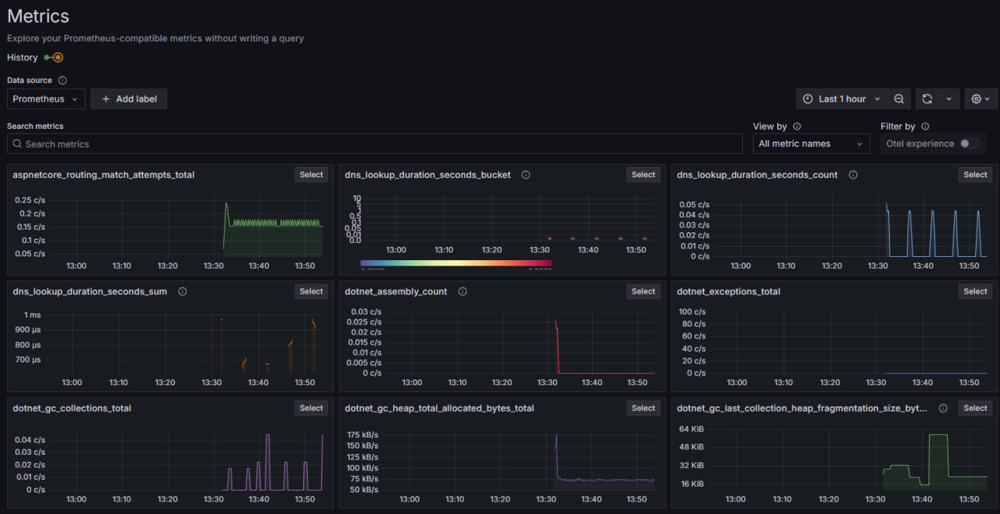

Глубокий экран .NET runtime полезен для анализа памяти, JIT, GC pause, CPU, working set и thread pool. По этим графикам видно старт приложения, прогрев JIT и дальнейшее стабильное состояние под demo-нагрузкой.

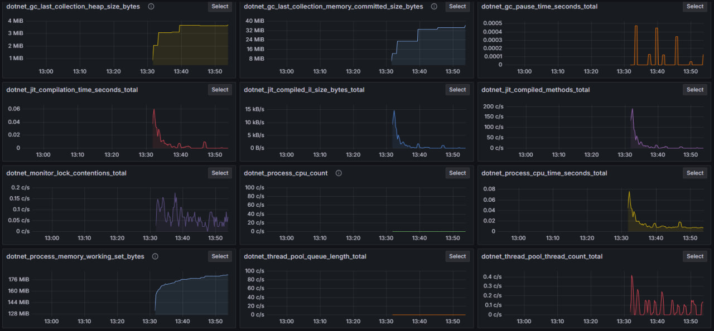

Метрики исходящего HTTP показывают активные запросы, соединения, длительность, очереди и bucket-распределения. В проекте они появляются из demo traffic и внутренних HTTP-вызовов.

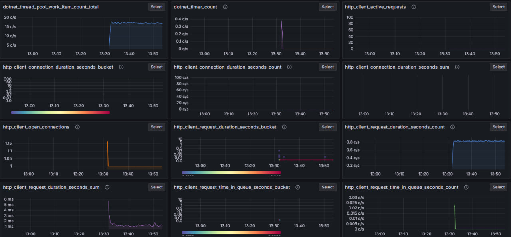

Метрики входящего HTTP и Kestrel показывают активные запросы, длительность обработки, соединения и доменные счетчики каталога заказов.

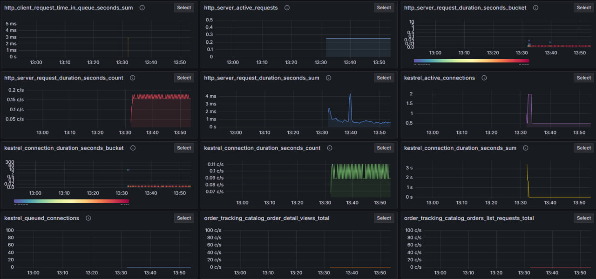

Отдельно вынесены продуктовые счетчики: созданные и завершенные заказы, обновления статусов, риск SLA, открытая рабочая очередь, публикации outbox в Kafka и ошибки публикации.

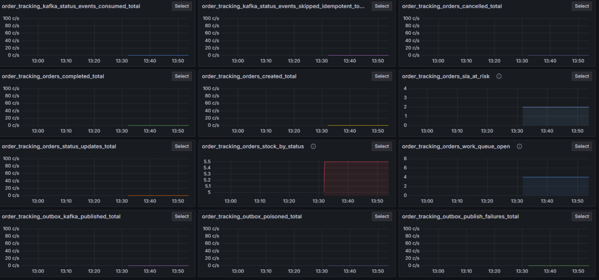

Отдельный экран scrape-метрик подтверждает состояние наблюдаемости: `scrape_duration_seconds`, количество samples, `target_info`, `otel_scope_info` и `up = 1`.

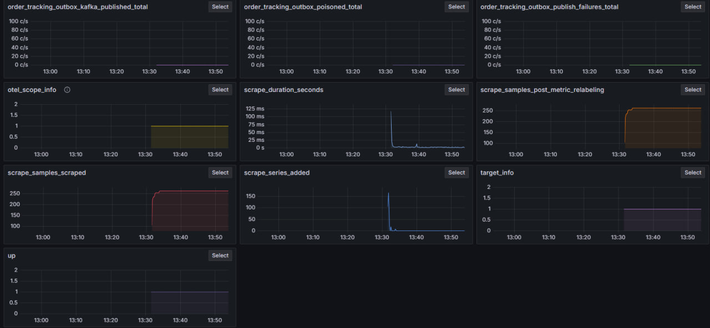

### Логи: Loki, VictoriaLogs и Grafana

В Loki удобно искать прикладные события. Запрос по `Broadcasted` показывает, что API получил событие и отправил realtime-обновление клиентам. В логах также видны `traceid` и `spanid`, поэтому запись можно связать с трассировкой.

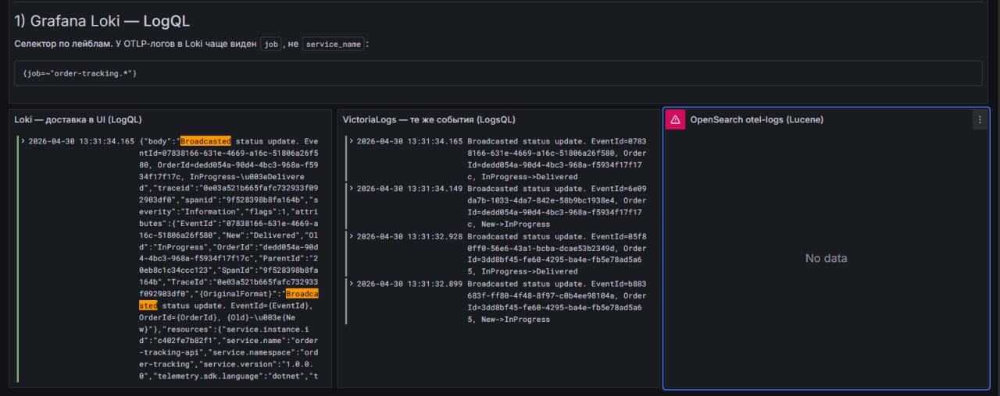

VictoriaLogs в Grafana показывает те же события в другом backend-хранилище. На примере worker видны SQL-запросы к `outbox_messages`, включая выборку с `FOR UPDATE SKIP LOCKED`.

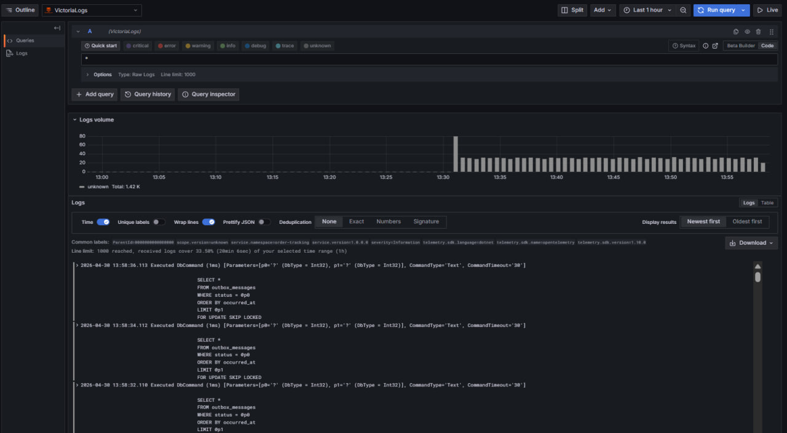

Встроенный интерфейс VictoriaLogs VMUI позволяет отдельно проверить поток логов worker и убедиться, что сервис получает записи напрямую.

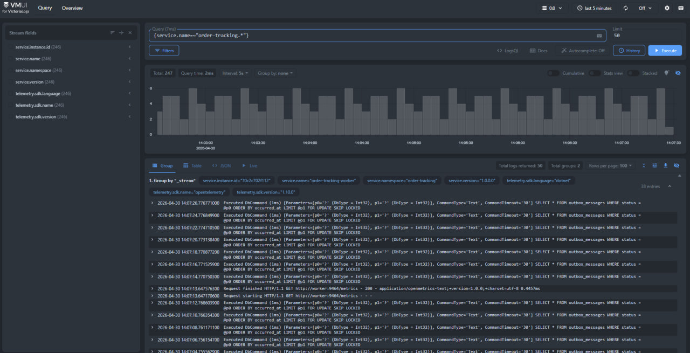

Сводный пример LogQL/LogsQL показывает, что Loki и VictoriaLogs могут использоваться параллельно: один и тот же поток событий доступен в разных интерфейсах.


### Трассировки Jaeger

Jaeger показывает распределение запросов по времени и длительности. Для `order-tracking-api` видны HTTP-запросы, health-check и операции `order_tracking`.

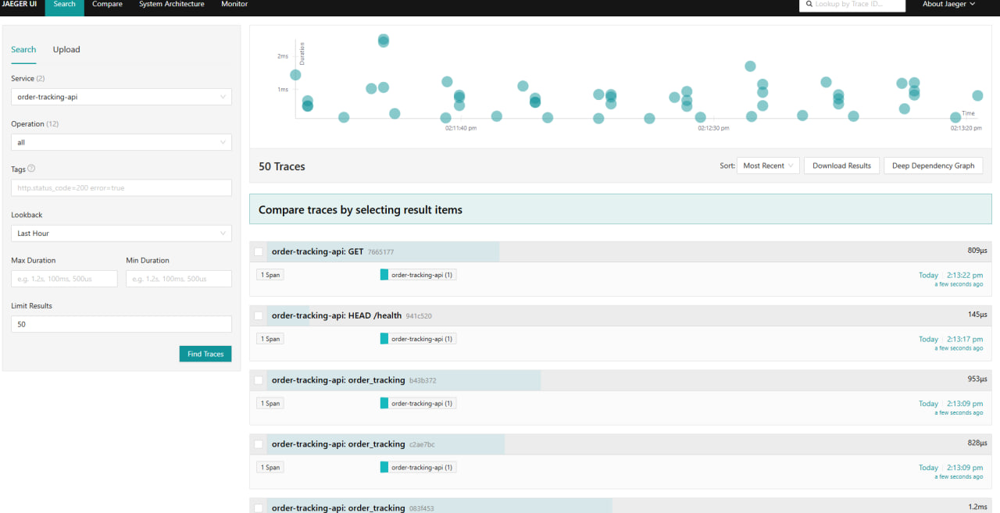

Список последних трасс API позволяет открыть конкретный запрос и посмотреть связанные spans.


Для `order-tracking-worker` видны фоновые операции обработки outbox и публикации событий. Это помогает отследить путь от записи в БД до Kafka.

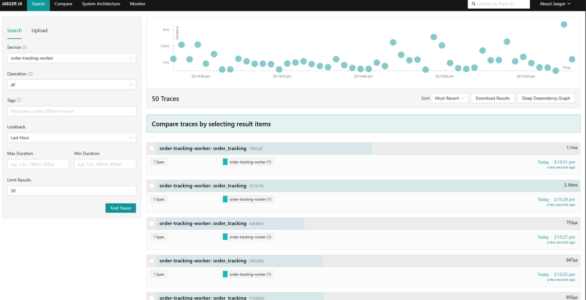

---

## Скриншоты интерфейсов

В репозитории заведена папка [`docs/screenshots`](docs/screenshots), на которую ссылается README и дополнительные документы. Ожидаемые файлы:

| Файл | Содержание |
|---|---|
| `metrics-prometheus-targets.png` | состояние Prometheus targets |
| `metrics-grafana-explore-runtime-overview.png` | обзор runtime-метрик |
| `metrics-grafana-explore-runtime-overview-alt.png` | дополнительный кадр runtime-метрик |
| `metrics-grafana-explore-dotnet-deep.png` | GC, JIT, CPU, память, thread pool |
| `metrics-grafana-explore-http-outbound.png` | исходящий HTTP |
| `metrics-grafana-explore-http-server-business.png` | входящий HTTP, Kestrel, бизнес-счетчики |
| `metrics-grafana-explore-business-counters.png` | продуктовые счетчики заказов, Kafka и outbox |
| `metrics-grafana-explore-scrape-target-health.png` | scrape и health target |
| `logs-grafana-loki-broadcasted.png` | Loki-запрос по broadcast-событиям |
| `logs-grafana-victorialogs-outbox.png` | VictoriaLogs в Grafana, outbox и EF Core |
| `logs-victorialogs-vmui-worker.png` | VMUI VictoriaLogs |
| `traces-jaeger-search-api-scatter.png` | Jaeger scatter для API |
| `traces-jaeger-search-api-list.png` | список трасс API |
| `traces-jaeger-search-worker.png` | трассы worker |

Если скриншоты нужно переснять из работающего стека, используйте Playwright-утилиту:

```bash
cd tools/doc-screenshots
npm run setup
npm run capture
```

На Windows можно запустить готовый wrapper:

```bat
tools\doc-screenshots\capture.cmd
```

После пересъемки PNG должны остаться с теми же именами, чтобы ссылки в markdown не ломались.

---

## Тестирование и CI

Локальная проверка backend:

```bash
dotnet restore OrderTracking.sln
dotnet format OrderTracking.sln --verify-no-changes
dotnet build OrderTracking.sln -c Release
dotnet test OrderTracking.sln -c Release --no-build
```

Локальная проверка frontend:

```bash
cd frontend
npm ci
npm run ci
```

Полезные скрипты:

```bash
bash scripts/ci-local.sh
```

```powershell
pwsh -File scripts/ci-local.ps1
```

GitHub Actions выполняет несколько групп проверок: lint для workflow и Dockerfile, .NET restore/build/test/format, frontend audit/lint/build, проверку markdown-asset'ов, Docker smoke-тесты, Trivy и CodeQL.

---

## Документация

| Документ | Назначение |
|---|---|
| [`docs/ci-cd.md`](docs/ci-cd.md) | CI/CD, GitHub Actions и проверки |
| [`docs/testing.md`](docs/testing.md) | тестовая стратегия |
| [`docs/logs-query-languages.md`](docs/logs-query-languages.md) | LogQL, LogsQL, Lucene и DQL |
| [`docs/traces-jaeger.md`](docs/traces-jaeger.md) | работа с трассировками в Jaeger |
| [`docs/grafana-dashboard.md`](docs/grafana-dashboard.md) | Grafana dashboard и панели наблюдаемости |
| [`docs/screenshots/README.md`](docs/screenshots/README.md) | генерация и обновление PNG-скриншотов |
| [`CONTRIBUTING.md`](CONTRIBUTING.md) | правила разработки и локальные проверки |
| [`SECURITY.md`](SECURITY.md) | безопасность, зависимости и секреты |

---

## Структура репозитория

```text
.
├── src/
│   ├── OrderTracking.Domain
│   ├── OrderTracking.Contracts
│   ├── OrderTracking.Application
│   ├── OrderTracking.Infrastructure
│   ├── OrderTracking.Presentation.Api
│   └── OrderTracking.Presentation.Worker
├── frontend/
├── tests/
├── deploy/
├── docs/
├── scripts/
├── tools/
├── docker-compose.yml
└── OrderTracking.sln
```

---

<div align="center">

Лабораторная работа · Инструментальные средства разработки ПО · ИТМО

</div>
