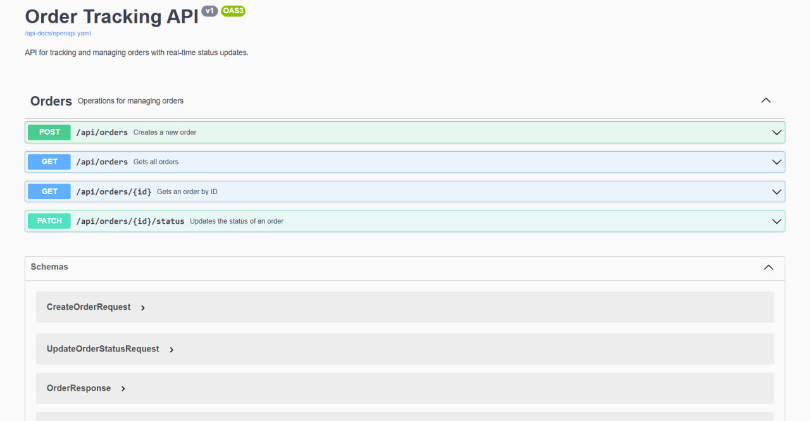
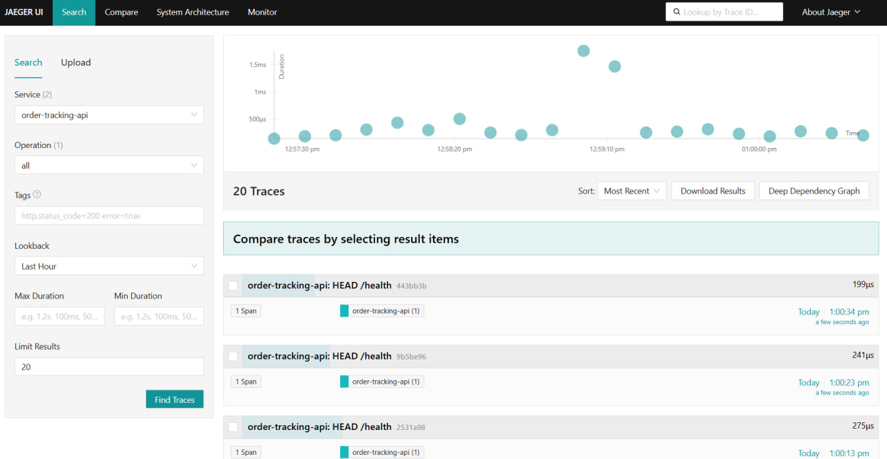

# Order Tracking

Система отслеживания заказов с real-time обновлениями через WebSocket.

## Подход к документации API (design-first)

Здесь реализовано так: [openapi.yaml](src/OrderTracking.Presentation.Api/openapi.yaml) → NSwag → [OrdersControllerBase.g.cs](src/OrderTracking.Presentation.Api/Generated/OrdersControllerBase.g.cs) → [OrdersController](src/OrderTracking.Presentation.Api/Controllers/OrdersController.cs) наследует и дополняет логикой.





## Технологии

- .NET 9.0, ASP.NET Core, EF Core
- PostgreSQL
- Kafka (Redpanda)
- SignalR

## Архитектура

Clean Architecture с разделением на слои:
- **Domain** - доменная модель без зависимостей
- **Contracts** - DTO и интеграционные события
- **Application** - абстракции для бизнес-логики
- **Infrastructure** - EF Core, Kafka, Outbox pattern
- **Presentation.Api** - REST API + SignalR Hub
- **Presentation.Worker** - фоновый сервис для публикации событий

## Запуск

### Docker Compose (рекомендуется)

```bash
docker compose up -d
```

После запуска:
- API: http://localhost:5086/swagger
- Jaeger UI: http://localhost:16686
- PostgreSQL: localhost:5432
- Kafka: localhost:19092

### Локально

Требуется PostgreSQL и Kafka/Redpanda.

```bash
# API
cd src/OrderTracking.Presentation.Api
dotnet run

# Worker (в отдельном терминале)
cd src/OrderTracking.Presentation.Worker
dotnet run
```

## Проверка работы

### 1. Создать заказ

```bash
curl -X POST http://localhost:5086/api/orders \
  -H "Content-Type: application/json" \
  -d '{"orderNumber":"ORD-001","description":"Test order"}'
```

Сохраните `id` из ответа.

### 2. Изменить статус

```bash
curl -X PATCH http://localhost:5086/api/orders/{ORDER_ID}/status \
  -H "Content-Type: application/json" \
  -d '{"status":"InProgress"}'
```

### 3. Проверить цепочку событий

**Outbox (БД):**
```bash
docker compose exec postgres psql -U postgres -d order_tracking \
  -c "SELECT id, type, status FROM outbox_messages ORDER BY occurred_at DESC LIMIT 5;"
```

**Логи Worker (публикация в Kafka):**
```bash
docker compose logs worker | grep "Kafka published"
```

**Логи API (обработка события и broadcast):**
```bash
docker compose logs api | grep "Broadcasted status update"
```

**ProcessedEvents (idempotency):**
```bash
docker compose exec postgres psql -U postgres -d order_tracking \
  -c "SELECT event_id, processed_at FROM processed_events ORDER BY processed_at DESC LIMIT 5;"
```

### 4. Проверить SignalR

Установите зависимости и запустите тестовый клиент:

```bash
cd tools
npm install
node signalr-client.js
```

Измените статус заказа через API - в консоли увидите событие.

## API

- `POST /api/orders` - создать заказ
- `GET /api/orders` - список заказов
- `GET /api/orders/{id}` - заказ по ID
- `PATCH /api/orders/{id}/status` - изменить статус

## SignalR

**Hub:** `/hubs/orders`

**Методы:**
- `JoinOrdersList()` - подписка на все заказы
- `JoinOrder(orderId)` - подписка на конкретный заказ

**События:**
- `orderStatusChanged` - изменение статуса

## Статусы

- `New` → `InProgress` | `Cancelled`
- `InProgress` → `Delivered` | `Cancelled`
- `Delivered`, `Cancelled` - финальные

## Observability 

Система использует OpenTelemetry для distributed tracing.

### Просмотр трейсов

1. Откройте Jaeger UI: http://localhost:16686
2. Выберите сервис `order-tracking-api` или `order-tracking-worker`
3. Нажмите "Find Traces"

### Что трейсится

- HTTP запросы (ASP.NET Core)
- EF Core запросы к БД
- Кастомные спаны:
  - `Outbox.Dispatch` - обработка outbox сообщений в Worker
  - `Kafka.Produce` - публикация событий в Kafka
  - `Kafka.Consume` - потребление событий из Kafka в API
  - `SignalR.Broadcast` - broadcast событий через SignalR