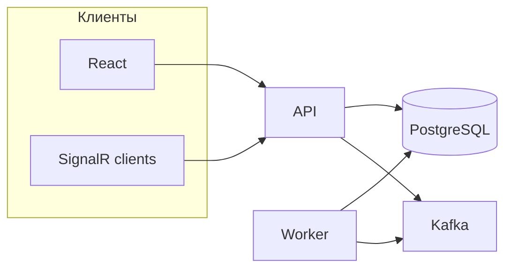
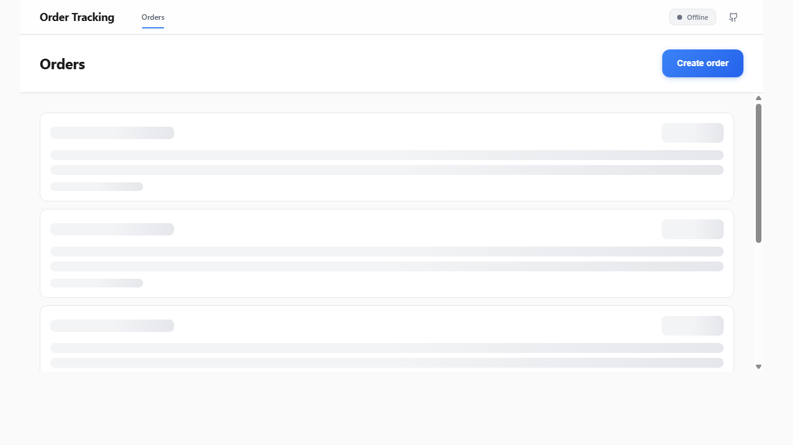
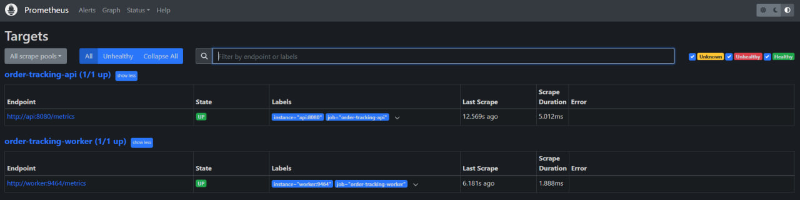

<div align="center">

# Order Tracking

### Заказы, статусы, Kafka и обновления в реальном времени

REST API · **Redpanda** (Kafka) · **outbox** · **SignalR** · React + Vite · OpenTelemetry

[](https://github.com/Ingaleee/Lab2/actions/workflows/ci.yml)
[](https://github.com/Ingaleee/Lab2/actions/workflows/codeql.yml)
[](https://dotnet.microsoft.com/)
[](https://react.dev/)
[](https://docs.docker.com/compose/)
[](https://www.postgresql.org/)

<br/>

| [Запуск](#запуск) · [Порты](#порты-и-url) · [Сценарий](#проверка-сценария-curl-signalr-бд) · [Наблюдаемость](#наблюдаемость) · [Доки](#документация) |
| :---: |

<sub>Если форк не от <code>Ingaleee/Lab2</code> — замени в бейджах CI и CodeQL <code>owner/repo</code> на свой.</sub>

<br/>

</div>

---

## Содержание

| Раздел | О чём |
|--------|--------|
| [Требования](#требования) | SDK, Node, Docker |
| [CI](#ci-и-локальная-проверка) | GitHub Actions и локальные команды |
| [Архитектура](#архитектура) | слои решения |
| [Запуск](#запуск) | Compose и локальный API / Worker |
| [Проверка сценария](#проверка-сценария-curl-signalr-бд) | curl, логи, SignalR |
| [API & SignalR](#эндпоинты-и-signalr) | эндпоинты и хаб |
| [Статусы заказа](#переходы-статусов-заказа) | переходы в домене |
| [Наблюдаемость](#наблюдаемость) | Jaeger, Grafana, логи |
| [Скриншоты](#скриншоты-интерфейсов) | PNG / Playwright |
| [Документация](#документация) | указатель `docs/` |
| [OpenAPI](#api-по-контракту-design-first) | design-first контракт |

---

## Требования

| Инструмент | Где зафиксировано |
|------------|-------------------|
| **.NET SDK** 9.x | [`global.json`](global.json) (`rollForward: latestFeature`) |
| **Node.js** | [`frontend/.nvmrc`](frontend/.nvmrc) |
| **Docker** | [`docker-compose.yml`](docker-compose.yml) — полный стек и сборка образов **api** / **worker** / **frontend** |

Источник NuGet — только **nuget.org** ([`nuget.config`](nuget.config)). Общие свойства MSBuild и аудит — [`Directory.Build.props`](Directory.Build.props).

---

## CI и локальная проверка

Отдельный workflow **[CodeQL](https://docs.github.com/en/code-security/code-scanning)** анализирует C# при push/PR и по расписанию (результаты — **Security → Code scanning**). Workflow **[CI](.github/workflows/ci.yml)** на **`ubuntu-24.04`**: **actionlint** + **hadolint** → параллельно **.NET** (**NU1902–NU1904**, **`dotnet format`**, **`dotnet test`**…), **frontend** (**`npm audit --audit-level=high`**…), **docs** (**PNG** + **lychee** по markdown) → **Docker** (образы, smoke, **Trivy**) → на PR **Dependency review** → **«CI — все проверки пройдены»**.

Подробности: [**docs/ci-cd.md**](docs/ci-cd.md) · [**scripts/README.md**](scripts/README.md) (локально почти как сервер: флаги **MATCH_CI_NUGET**, PNG, smoke) · [**docs/testing.md**](docs/testing.md) · [**CONTRIBUTING.md**](CONTRIBUTING.md)

Тот же набор шагов одной командой: **`bash scripts/ci-local.sh`** или **`pwsh -File scripts/ci-local.ps1`** (см. [CONTRIBUTING.md](CONTRIBUTING.md)).

**Как в CI, из корня репозитория:**

```bash
dotnet restore OrderTracking.sln
dotnet format OrderTracking.sln --verify-no-changes
dotnet build OrderTracking.sln -c Release
dotnet test OrderTracking.sln -c Release --no-build
# как в CI — ещё и покрытие (отчёты в ./TestResults-ci):
dotnet test OrderTracking.sln -c Release --no-build --collect:"XPlat Code Coverage" --results-directory ./TestResults-ci

cd frontend && npm ci && npm run ci && cd ..
```

После **`npm ci`** в `frontend/` команда **`npm run ci`** делает **`npm audit --audit-level=high`** → lint → format:check → build ([`frontend/package.json`](frontend/package.json)).

Тот же шаг, что job **docs-assets** в Actions: из корня **`node scripts/verify-docs-assets.mjs`** (или в конце **`ci-local`**: **`VERIFY_DOCS_ASSETS=1 bash scripts/ci-local.sh`**, **`pwsh -File scripts/ci-local.ps1 -VerifyDocsAssets`**).

---

## Архитектура

Clean Architecture:

| Слой | Роль |
|------|------|
| **Domain** | доменная модель, без внешних зависимостей |
| **Contracts** | DTO и интеграционные события |
| **Application** | абстракции и сценарии |
| **Infrastructure** | EF Core, Kafka, outbox |
| **Presentation.Api** | REST, SignalR Hub |
| **Presentation.Worker** | публикация событий из outbox |

**Стек:** .NET 9, ASP.NET Core, EF Core, PostgreSQL, Kafka (Redpanda в compose), SignalR.



---

## Запуск

### Через Docker Compose

```bash
docker compose up -d
```

#### Порты и URL

| Сервис | Адрес |
|--------|--------|
| API (health) | http://localhost:5086/health |
| OpenAPI (YAML) | http://localhost:5086/api-docs/openapi.yaml |
| Swagger UI *(Development)* | http://localhost:5086/swagger |
| Frontend (nginx) | http://localhost:5173 |
| Jaeger | http://localhost:16686 |
| Grafana `admin` / `admin` | http://localhost:13001 |
| Prometheus | http://localhost:9090 |
| Loki (с хоста) | http://localhost:13100 |
| OpenSearch API | http://localhost:9200 |
| OpenSearch Dashboards | http://localhost:5601 |
| VictoriaLogs | http://localhost:9428 |
| OTLP gRPC | `localhost:4317` |
| PostgreSQL *(хост)* | **localhost:15432** *(в сети compose — `postgres:5432`)* |
| Kafka / Redpanda *(хост)* | **localhost:19092** |

### Локально (только API и Worker)

Минимум зависимостей:

```bash
docker compose up -d postgres redpanda jaeger otel-collector
```

В [`appsettings.json`](src/OrderTracking.Presentation.Api/appsettings.json) — типичные порты с хоста: Postgres **15432**, Kafka **19092**, OTLP **http://localhost:4317**.

```bash
cd src/OrderTracking.Presentation.Api && dotnet run
```

```bash
cd src/OrderTracking.Presentation.Worker && dotnet run
```

---

## Проверка сценария (curl, SignalR, БД)

### Нагрузка под метрики (DemoTraffic)

В compose для **api** по умолчанию включён **`DemoTraffic__*`** ([`docker-compose.yml`](docker-compose.yml)): через ~1–2 минуты после `up` метрики начинают заполняться. Выключить: убрать `DemoTraffic__Enabled=true` или задать `false`.

### 1. Создать заказ

```bash
curl -X POST http://localhost:5086/api/orders \
  -H "Content-Type: application/json" \
  -d '{"orderNumber":"ORD-001","description":"Test order"}'
```

Сохрани **id** из ответа.

### 2. Поменять статус

```bash
curl -X PATCH http://localhost:5086/api/orders/{ORDER_ID}/status \
  -H "Content-Type: application/json" \
  -d '{"status":"InProgress"}'
```

### 3. Цепочка: outbox → Kafka → API

**Outbox:**

```bash
docker compose exec postgres psql -U postgres -d order_tracking \
  -c "SELECT id, type, status FROM outbox_messages ORDER BY occurred_at DESC LIMIT 5;"
```

**Worker (Kafka):**

```bash
docker compose logs worker | grep "Kafka published"
```

**API (broadcast):**

```bash
docker compose logs api | grep "Broadcasted status update"
```

**ProcessedEvents:**

```bash
docker compose exec postgres psql -U postgres -d order_tracking \
  -c "SELECT event_id, processed_at FROM processed_events ORDER BY processed_at DESC LIMIT 5;"
```

### 4. SignalR — тестовый клиент

```bash
cd tools
npm install
node signalr-client.js
```

После смены статуса через API в консоли клиента появится событие.

---

## Эндпоинты и SignalR

| REST | Описание |
|------|----------|
| `POST /api/orders` | создать заказ |
| `GET /api/orders` | список |
| `GET /api/orders/{id}` | карточка |
| `PATCH /api/orders/{id}/status` | смена статуса |

**Hub:** `/hubs/orders`

| Тип | Имя |
|-----|-----|
| Методы клиента | `JoinOrdersList()`, `JoinOrder(orderId)` |
| Событие | `orderStatusChanged` |

---

## Переходы статусов заказа

```
New ──► InProgress ──► Delivered
 │           │
 └──► Cancelled ◄────┘
```

- Финальные: **Delivered**, **Cancelled**

---

## Наблюдаемость

OpenTelemetry: трейсы и метрики.

| Задача | Куда смотреть |
|--------|----------------|
| Трейсы | [Jaeger](http://localhost:16686) — `order-tracking-api`, `order-tracking-worker` |
| Дашборды | [Grafana](http://localhost:13001) — Prometheus, Loki, OpenSearch, VictoriaLogs (плагин в [`docker-compose.yml`](docker-compose.yml)) |
| Метрики сырые | [Prometheus](http://localhost:9090) — `/metrics` у API и Worker |
| VictoriaLogs | http://localhost:9428 |

**Логи:** OTLP → collector → **Loki**, **OpenSearch**, **VictoriaLogs**. На дашборде Grafana — LogQL, LogsQL, Lucene → [**docs/logs-query-languages.md**](docs/logs-query-languages.md).

**Трейсы:** OTLP → [**docs/traces-jaeger.md**](docs/traces-jaeger.md).

**Дашборд:** [**docs/grafana-dashboard.md**](docs/grafana-dashboard.md).

### Иллюстрации: метрики, сбор и связка с логами

Ниже — скриншоты из поднятого стека (`docker compose up -d`): Prometheus и Grafana (**Explore → Metrics**, источник Prometheus). Файлы лежат в [`docs/screenshots/`](docs/screenshots/).

#### 1. Prometheus: цели сбора (`/targets`)

Два job’а в статусе **UP**: API отдаёт метрики на `http://api:8080/metrics`, worker — на `http://worker:9464/metrics`. Это базовая проверка, что экспортёры доступны и scrape проходит без ошибок.


#### 2–3. Grafana Explore → Metrics: входящий HTTP, DNS, сборки, исключения, GC (обзор)

Встроенный режим **Metrics** в Grafana (данные с Prometheus) без ручного PromQL: маршрутизация ASP.NET Core (`aspnetcore_routing_match_attempts_total`), DNS-клиент, счётчик сборок (`dotnet_assembly_count`), отсутствие исключений (`dotnet_exceptions_total` на нуле), активность GC и аллокаций на куче. Два кадра — соседние страницы/масштаб того же типа дашборда.


#### 4. Среда выполнения .NET подробно

Панели GC (размер кучи после сборки, паузы JIT, объём скомпилированного IL, методы), блокировки монитора, CPU процесса, working set, очередь thread pool. По графикам видно старт приложения (всплеск JIT) и затем устойчивое состояние под нагрузкой DemoTraffic.


#### 5. Исходящий HTTP (`HttpClient`)

Метрики клиента: открытые соединения, длительность запросов, время в очереди, распределения по bucket’ам. Для этого API характерен цикл вызовов к самому себе (DemoTraffic через `127.0.0.1:8080`), поэтому видны стабильные исходящие запросы и один долгоживущий коннект.


#### 6. Входящий HTTP (Kestrel) и продуктовые счётчики

Серверная часть: активные запросы, длительность обработки, соединения Kestrel, очередь соединений. Внизу — кастомные счётчики домена (`order_tracking_catalog_orders_list_requests_total`, `order_tracking_catalog_order_detail_views_total`), которые считаются в коде и попадают в Prometheus через OTEL meter.


#### 7. Метаданные scrape и здоровье цели в Grafana

Показатели самого процесса scraping’а: `scrape_duration_seconds`, число сэмплов, серии, а также **otel_scope_info**, **target_info** и **`up` = 1** для выбранного таргета. Подтверждает, что Grafana читает те же данные, что видит Prometheus, и что цель считается доступной.


### Иллюстрации: логи (Loki, VictoriaLogs, VMUI)

Цепочка **OTLP → collector → Loki / VictoriaLogs** и типичные запросы разобраны в [**docs/logs-query-languages.md**](docs/logs-query-languages.md). Ниже — три скрина из поднятого стека; файлы в [`docs/screenshots/`](docs/screenshots/).

#### 1. Grafana → Loki: доставка статуса в UI (Broadcasted)

**Explore** или панель **Logs**, datasource **Loki**, режим **Code**, запрос:

```logql
{job=~"order-tracking.*"} |= "Broadcasted"
```

На скрине: гистограмма **Logs volume** и строки **Information** из **`OrderStatusKafkaConsumerHostedService`**: сообщение **Broadcasted status update**, переходы статусов заказа (**Old** / **New**), в теле OTLP — **`traceid`** и **`spanid`** (удобно искать ту же трассу в Jaeger).


#### 2. Grafana → VictoriaLogs: outbox и EF в потоке логов

Тот же стек, datasource **VictoriaLogs**, широкий селектор по сервисам, например `{service.name=~"order-tracking.*"}`. В потоке видны структурированные записи **Entity Framework**: выполнение **`DbCommand`** с запросом к **`outbox_messages`** (`FOR UPDATE SKIP LOCKED`) — это фоновый **worker**, который по паттерну **transactional outbox** забирает сообщения перед публикацией в Kafka. Дополнительно могут проходить строки про scrape **`GET …/metrics`** — это нормальная фоновая активность наблюдаемости.


#### 3. VictoriaLogs VMUI (`:9428`): worker и outbox «как в логах целиком»

Нативный UI по адресу **http://localhost:9428**: запрос **`{service.name=~"order-tracking.*"}`** за последние минуты. На скрине явно выделен поток **`order-tracking-worker`**: периодический **`SELECT * FROM outbox_messages … FOR UPDATE SKIP LOCKED`**, ответы **`HTTP/1.1 GET http://worker:9464/metrics`** со статусом **200** — видно и бизнес-цикл outbox, и успешный scrape Prometheus с worker.


### Иллюстрации: трейсы (Jaeger)

Подробный разбор UI, тегов и типичных имён операций — [**docs/traces-jaeger.md**](docs/traces-jaeger.md). Ниже три кадра **экрана поиска** (**http://localhost:16686**): два для **`order-tracking-api`** (диаграмма + список), один для **`order-tracking-worker`**. Имеет смысл приложить к отчёту вместе с [**деталью трассы**](docs/traces-jaeger.md) (`jaeger-trace-detail.png`), когда в дереве видны нужные спаны.

#### 1. API: диаграмма и список трасс

Сервис **`order-tracking-api`**, lookback **Last Hour**. Видны быстрые **`HEAD /health`**, **`GET`** и серии **`order_tracking`** — смешение HTTP и коротких трасс, связанных с инфраструктурой запросов к БД.


#### 2. API: фрагмент списка (недавние трассы)

Тот же сервис: удобно показать в отчёте «живой» поток операций и пометку **1 Span** в строке — напоминание открыть трассу целиком или использовать **Tags** для поиска по Kafka / доменным полям.


#### 3. Worker: фоновые трассы

Сервис **`order-tracking-worker`**: регулярные короткие трассы с операцией вроде **`order_tracking`** соответствуют циклу работы воркера с базой и **outbox**; детали спанов **`Outbox.Dispatch`** / **`Kafka.Produce`** — после перехода внутрь выбранной трассы.


### Спаны в коде

- HTTP (ASP.NET Core), EF Core  
- Кастомные: `Outbox.Dispatch`, `Kafka.Produce`, `Kafka.Consume`, `SignalR.Broadcast`

---

## Скриншоты интерфейсов

PNG генерируются скриптом Playwright при поднятом **`docker compose`** — полная инструкция: [**docs/screenshots/README.md**](docs/screenshots/README.md). На Windows: [`tools/doc-screenshots/capture.cmd`](tools/doc-screenshots/capture.cmd) (зависимости подтягивает сам); без батника: в **`tools/doc-screenshots`** один раз **`npm run setup`**, далее **`npm run capture`**. Для пайплайнов с проверкой результата — **`capture:strict`** / **`--strict`** (см. тот же документ). Если в клоне не хватает части картинок — съёмка локально и в коммит: **`git add docs/`** (или в Git Bash — `git add docs/**/*.png`).

<p align="center">
  
  
</p>

---

## Документация

| Документ | Содержание |
|----------|------------|
| [**docs/ci-cd.md**](docs/ci-cd.md) | GitHub Actions, Dependabot |
| [**CONTRIBUTING.md**](CONTRIBUTING.md) | локальные проверки, скрипты `scripts/ci-local.*` |
| [**SECURITY.md**](SECURITY.md) | отчёты об уязвимостях, секреты и CI |
| [**docs/testing.md**](docs/testing.md) | Unit / integration |
| [**docs/logs-query-languages.md**](docs/logs-query-languages.md) | LogQL, LogsQL, Lucene, DQL |
| [**docs/traces-jaeger.md**](docs/traces-jaeger.md) | Jaeger и связка с логами |
| [**docs/grafana-dashboard.md**](docs/grafana-dashboard.md) | продуктовый дашборд |
| [**docs/README.md**](docs/README.md) | указатель иллюстраций |

---

## API по контракту (design-first)

Контракт — [`openapi.yaml`](src/OrderTracking.Presentation.Api/openapi.yaml). **NSwag** генерирует [`OrdersControllerBase.g.cs`](src/OrderTracking.Presentation.Api/Generated/OrdersControllerBase.g.cs); реализация — [`OrdersController`](src/OrderTracking.Presentation.Api/Controllers/OrdersController.cs).

<p align="center">
  
  
</p>

<div align="center">

<sub>Лабораторная работа · Инструментальные средства разработки ПО · ИТМО</sub>

</div>
