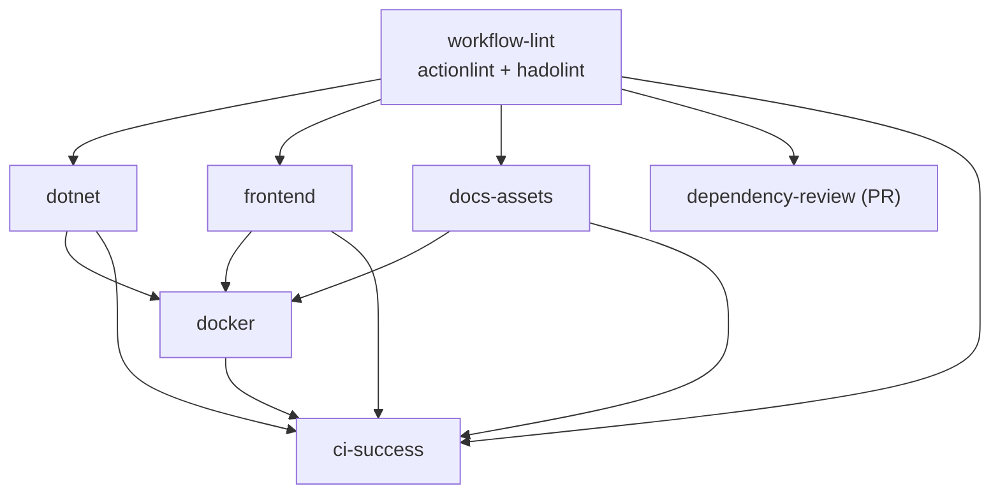

# CI/CD

В репозитории настроен контроль качества через **GitHub Actions**: основной пайплайн **[`.github/workflows/ci.yml`](../.github/workflows/ci.yml)** и отдельно **[Code scanning / CodeQL](../.github/workflows/codeql.yml)** по C#.

Блок **«Что часто спрашивают на защите»** ниже начинается с **короткого скрипта на ~2 минуты**; длинные подразделы — справочник, если препод углубится.

---
Версия **.NET SDK** для локальных и CI-сборок задаётся **`global.json`** в корне репозитория.

Файл **`nuget.config`** задаёт источник пакетов только **`nuget.org`** (без подмешивания глобальных feeds с машины разработчика — одинаковое поведение локально и в CI).

В **`Directory.Build.props`** включён **NuGet Audit** для прямых зависимостей (`NuGetAuditMode`: `direct`), минимальная серьёзность предупреждений при восстановлении — **`moderate`** (`NuGetAuditLevel`), чтобы не зашумлять вывод низкими уровнями.

В **CI** для `frontend` после `npm ci` восстанавливается кэш **ESLint** (файл `.eslintcache`), затем выполняется **`npm run ci`**: **`npm audit --audit-level=high`** → lint → format:check → build. Для быстрой локальной проверки без жёсткости CI: **`npm run audit`** (порог **`moderate`**, как у NuGet Audit в [`Directory.Build.props`](../Directory.Build.props)).

Подробнее про unit- и integration-тесты: [docs/testing.md](testing.md).

## Перед сдачей

**Автоматика в основном workflow CI уже делает:** **actionlint** + **hadolint**; .NET (`dotnet format`, тесты с покрытием; в CI **NU1902–NU1904** — ошибка); frontend **`npm run ci`** (**`audit --audit-level=high`** и далее); в job **docs**: PNG (**`verify-docs-assets.mjs`**) и **[lychee](https://github.com/lycheeverse/lychee)** по markdown; сборку образов; smoke (**[`docker-compose.smoke.yml`](../docker-compose.smoke.yml)** → **GET /health**); **Trivy** (отчёт и **CRITICAL gate** для API). На PR — **dependency-review**. Отдельно см. раздел **Workflow CodeQL** ниже.

**Остаётся сделать тебе (репозиторий сам не закоммитит и не настроит GitHub):**

1. **Все файлы из [`scripts/verify-docs-assets.mjs`](../scripts/verify-docs-assets.mjs) должны лежать в Git** — иначе job **Docs — PNG, ссылки** красный. Локально: **`node scripts/verify-docs-assets.mjs`** (код **0** — ок).
2. **`git add` / `commit` / `push`** и убедиться, что последние прогоны workflow **CI** и **CodeQL** зелёные (**Actions**).
3. Если репозиторий не **`Ingaleee/Lab2`** — в [**README**](../README.md) поправь бейджи **CI** и **CodeQL** (**owner/repo**).
4. По условиям задания включи **branch protection**: как минимум **«CI — все проверки пройдены»**; при необходимости отдельно потребуй успешный **CodeQL** (**Security → Code scanning**) и **Dependency review** на PR (см. таблицу чеклиста).
5. Для отчёта/демонстрации наблюдаемости полный стек всё равно подними локально: **`docker compose up -d`** по основному [`docker-compose.yml`](../docker-compose.yml) — smoke в CI не поднимает Grafana/Jaeger/OpenSearch.

---

## Workflow `CodeQL` ([`.github/workflows/codeql.yml`](../.github/workflows/codeql.yml))

| Триггер | Описание |
|---------|----------|
| **push** / **pull_request** | Ветки **`main`** / **`master`** |
| **schedule** | Раз в неделю (UTC), чтобы ловить регрессии при обновлении баз правил |
| **workflow_dispatch** | Ручной запуск |

Анализ языка **C#** ([**CodeQL**](https://codeql.github.com/docs/)): набор запросов **`security-and-quality`**. Перед **`analyze`** выполняется **`dotnet restore`** и **`dotnet build`** решения (**`/p:SkipNSwag=true`**). Результаты загружаются в [**Code scanning**](https://docs.github.com/en/code-security/code-scanning) репозитория (**Advanced Security** не обязателен для **публичных** репозиториев; для **частных** см. тариф GitHub).

Права job: **`security-events: write`** (загрузка SARIF), **`contents: read`**, **`actions: read`**. Workflow **не** входит в **`needs`** у job **«CI — все проверки пройдены»** — это отдельный статус в Checks; при строгой политике добавьте оба workflow в branch protection.

---

## Workflow `CI` ([`.github/workflows/ci.yml`](../.github/workflows/ci.yml))

| Триггер | Описание |
|---------|----------|
| **push** / **pull_request** | Ветки **`main`** и **`master`** (обе в списке — CI работает и после переименования default branch, и в старых клонах с **master**) |
| **workflow_dispatch** | Ручной запуск: вкладка **Actions** → workflow **CI** → **Run workflow** |

У **`pull_request`** без явного **`types:`** workflow запускается на типичных действиях с PR (включая синхронизацию после push); **draft**-pull request тоже запускает проверки (если нужно исключить — задают **`types`** или условие **`if`** по **`github.event.pull_request.draft`**).

Минимальные права на уровне workflow: `permissions: contents: read`. На уровне **отдельных job** права заданы явно (принцип наименьших привилегий):

| Job | `permissions` |
|-----|----------------|
| **workflow-lint**, **frontend**, **docs-assets**, **docker**, **ci-success** | `contents: read` |
| **dotnet** | `contents: read`, **`checks: write`** (публикация TRX через publish-unit-test-result) |
| **dependency-review** | `contents: read`, **`pull-requests: read`** |

Runner — **GitHub-hosted** `ubuntu-24.04` (фиксированная версия образа). Явная метка вместо **`ubuntu-latest`** уменьшает неожиданный «дрейф» окружения, когда GitHub обновляет состав **latest**. Для сборки Linux-образов Docker типично использовать **Linux**-runner; **Windows**/**macOS** hosted-runner’ы по [тарификации минут](https://docs.github.com/en/billing/reference/actions-runner-pricing) обходятся дороже Linux при том же времени job. Свой runner (**self-hosted**) в этом проекте не используется; для лабораторной это упрощает воспроизводимость и не требует администрирования runner’ов.

**Concurrency:** `cancel-in-progress: true` — при новом push в ту же ветку предыдущий прогон отменяется, чтобы не тратить минуты runner’ов на устаревший коммит. Группа **`${{ github.workflow }}-${{ github.ref }}`** задаётся так, чтобы **разные ветки** не отменяли чужие прогоны — только повторные запуски для **одной и той же** ссылки (`ref`).

**Артефакт `dotnet-test-results`:** `retention-days: 14` — достаточно для разбора упавшего прогона без долгого хранения.

### Job dependency graph



Сначала **workflow-lint** (**actionlint** по YAML workflow и **hadolint** по трём **Dockerfile** с [`.hadolint.yaml`](../.hadolint.yaml)); затем параллельно **dotnet**, **frontend** и **docs-assets**; затем **docker**; на PR после lint — **dependency-review**. **ci-success** ждёт **workflow-lint**, **dotnet**, **frontend**, **docs-assets**, **docker**. Связь **dependency-review → ci-success** на графе **намеренно не рисуется**: job не входит в `needs` у **ci-success** (почему так — в чеклисте по защите и в «Уточняющие вопросы» ниже).

| Job | Что делает |
|-----|------------|
| **workflow-lint** | [actionlint](https://github.com/rhysd/actionlint) по **`.github/workflows/*.yml`**; [hadolint](https://github.com/hadolint/hadolint) по **Dockerfile** **api** / **worker** / **frontend** и [`.hadolint.yaml`](../.hadolint.yaml); лимит — 10 мин. |
| **dotnet** | Кэш NuGet → `restore` → **`dotnet format --verify-no-changes`** → `build` → **`dotnet test`** с **`--collect:"XPlat Code Coverage"`** (coverlet, Cobertura); в CI предупреждения **NU1902–NU1904** — ошибки ([`Directory.Build.props`](../Directory.Build.props)); TRX в **Checks** ([publish-unit-test-result-action](https://github.com/EnricoMi/publish-unit-test-result-action)) для PR/commit из **этого же** репозитория (не fork); артефакт **`dotnet-test-results`**: **`TestResults/`**; лимит — 30 мин.; **`ContinuousIntegrationBuild`** через `Directory.Build.props` |
| **frontend** | Шаг с `node --version`; `npm ci`; кэш **`frontend/.eslintcache`**; **`npm run ci`**; Node из `frontend/.nvmrc`; лимит — 20 мин. |
| **docs-assets** | Node из `frontend/.nvmrc`; **`node scripts/verify-docs-assets.mjs`**; **[lychee](https://github.com/lycheeverse/lychee)** по `README.md`, `CONTRIBUTING.md`, `SECURITY.md`, каталогу **`docs/`** (исключены localhost); лимит — 15 мин. |
| **docker** | После успеха **dotnet**, **frontend** и **docs-assets**: валидация `docker-compose.yml` и [`docker-compose.smoke.yml`](../docker-compose.smoke.yml) → сборка **`api`**, **`worker`**, **`frontend`** (теги **`order-tracking-*:local`**); **smoke:** postgres + redpanda + **api**, **GET /health** (порт **`15086`**); **Trivy:** три отчёта HIGH/CRITICAL (**`exit-code: 0`**) + отдельный шаг с **`exit-code: 1`** только для **CRITICAL** у **`order-tracking-api:local`**; лимит — 55 мин. |
| **Dependency review** | Только событие **`pull_request`**: [dependency-review-action](https://github.com/actions/dependency-review-action) сравнивает манифесты зависимостей с базовой веткой (уязвимости и лицензии). На **публичных** репозиториях доступно без доп. подписок; для **частных** может потребоваться GitHub Advanced Security — см. [документацию](https://docs.github.com/en/code-security/supply-chain-security/understanding-your-software-supply-chain/about-dependency-review). |
| **CI — все проверки пройдены** | Зависит от **workflow-lint**, **dotnet**, **frontend**, **docs-assets**, **docker**; в summary — прямая ссылка на прогон; удобно как **одна** обязательная проверка в **branch protection** |

Одновременные прогоны одной ветки отменяются (`cancel-in-progress`). У каждого job задан **`timeout-minutes`**, чтобы зависшие шаги не занимали runner бесконечно.

В конце каждого job в интерфейсе GitHub Actions добавляется краткий **Job summary**: шаги дописывают Markdown в переменную окружения **`$GITHUB_STEP_SUMMARY`** — удобно для человекочитаемой сводки без прокрутки всего лога.

Другие [**workflow commands**](https://docs.github.com/en/actions/using-workflows/workflow-commands-for-github-actions): запись в **`$GITHUB_ENV`** задаёт переменные окружения для **следующих** шагов того же job; **`$GITHUB_OUTPUT`** — именованные выходы шага (в т.ч. для **`jobs.<id>.outputs`** и передачи в downstream job через **`needs`**). В этом файле они не обязательны — достаточно стандартных шагов и контекста **`github.*`**.

**Выражения и функции в YAML:** ключи кэша используют **`hashFiles('**/pattern')`** и контекст **`github`** (например **`runner.os`**). Условия шагов и **`if:`** задаются через **`${{ }}`** — см. [Expressions](https://docs.github.com/en/actions/learn-github-actions/expressions); там же **`success()`**, **`failure()`**, **`always()`** для типичных ветвлений.

**Кэширование:** в job **dotnet** — каталог глобальных пакетов NuGet (`actions/cache`, ключ от хэша `*.csproj`, `*.props`, `global.json`, `nuget.config`); у **`actions/cache`** заданы **`restore-keys`** с префиксом **`${{ runner.os }}-nuget-`** — при полном промахе ключа подставляется **ближайший** старый кэш с тем же префиксом (частичное совпадение, не пустой кэш). В **frontend** — зависимости npm через **`setup-node`** (`cache: npm` и `package-lock.json`) и отдельно кэш **`.eslintcache`** с **`restore-keys`** по префиксу `eslint`. При смене зависимостей основной ключ меняется — точный hit не гарантирован, но префиксные ключи ускоряют повторные прогоны.

**Переменные окружения в workflow:** блок верхнего уровня **`env:`** (`DOTNET_NOLOGO`, `DOTNET_CLI_TELEMETRY_OPTOUT`, `DOCKER_BUILDKIT`) наследуется всеми job, если локально не переопределён — меньше шума в логах и предсказуемая сборка образов.

**Интеграционные тесты в job dotnet** не поднимают Postgres/Kafka: используется InMemory EF и отключение фоновых сервисов — см. [docs/testing.md](testing.md). **Рантайм-проверка образа API** в job **docker**: после **`docker compose build`** поднимается минимальный стек [docker-compose.smoke.yml](../docker-compose.smoke.yml) (Postgres + Redpanda + **api** без observability-цепочки) и выполняется **GET /health**; полный **`docker compose`** (все сервисы) остаётся для локального сценария.

**Артефакты и падение тестов:** загрузка **`dotnet-test-results`** и сводка в summary для .NET выполняются с **`if: always()`** там, где нужно — чтобы при упавших тестах всё равно сохранить TRX/Cobertura для разбора. Публикация TRX в **Checks** включена только при выполнимых условиях (в т.ч. не fork).

**Кэш vs артефакт:** **cache** — ускорение повторных прогонов (NuGet/npm/ESLint), не гарантирован и может быть вытеснен; **artifact** — именно для скачивания отчётов (`dotnet-test-results`), с **`retention-days`**.

**Checkout (`actions/checkout`):** в job **dotnet**, **frontend**, **docs-assets**, **docker** задано **`fetch-depth: 1`** — shallow clone, меньше данных и времени; для сборки и тестов полная история Git не нужна. В **dependency-review** — **`fetch-depth: 0`** (полный clone): [dependency-review-action](https://github.com/actions/dependency-review-action) опирается на историю коммитов при сравнении базовой и головной ветки PR.

**actionlint:** устанавливается бинарником версии **1.7.7** с официального релиза (архив по `curl`) — фиксированная версия без дополнительной обёртки в Marketplace.

**Порядок шагов в job dotnet:** `restore` → **`dotnet format --verify-no-changes`** → **`build`** → **`dotnet test --no-build`**. Флаг **`--no-build`** у тестов означает: прогоняется уже собранное в предыдущем шаге решение в **Release**, без скрытой повторной сборки внутри `dotnet test`.

**Где выполняется код:** команды идут на **виртуальной машине** runner’а (`runs-on`). Отдельный синтаксис **`jobs.<id>.container:`** (весь job в контейнере) не используется — приложение упаковывается в Docker только в шагах job **docker**. Не путать с тем, что внутри этого job вызываются **`docker compose build`**.

**Job frontend:** задано **`defaults.run.working-directory: frontend`** — все shell-шаги выполняются из каталога `frontend/` без повторения `cd`.

**Сборка образов и registry:** **`docker compose build --pull`** подтягивает базовые слои с Docker Hub и других registry; у Docker Hub есть [лимиты на pull](https://docs.docker.com/docker-hub/download-rate-limit/) для анонимных и бесплатных аккаунтов — при частых CI-сборках возможны отказы по rate limit. Типичные меры: вход через **`docker/login-action`**, использование образов из **GHCR** или кэширование слоёв.

---

## Что часто спрашивают на защите лабораторной по CI

**Нужно ли зубрить всё ниже?** Нет. На защите обычно достаточно: открыть вкладку **Actions**, показать последний зелёный прогон, [граф job'ов](#job-dependency-graph) и уметь связно сказать **четыре вещи**: (1) зачем **actionlint** до тяжёлых job; (2) почему **`permissions`** узкие и где **`checks: write`**; (3) чем **артефакт** отличается от **кэша**; (4) что это **проверки перед merge**, а не деплой в прод. Всё остальное в этом файле — **справочник на случай докапываний**, а не минимальный объём для оценки.

### Защита за ~2 минуты (можно почти дословно)

1. **Задача pipeline:** не допускать сломанной сборки, несогласованного стиля и известных уязвимых зависимостей в общей ветке — проверки выполняются на сервере одинаково для всех, локальные хуки обходимы.
2. **Структура:** линт (**actionlint** + **hadolint**) → параллельно **.NET** (в CI **NU1902+** как ошибки), **frontend** и **docs-assets** (PNG + **lychee**) → **Docker** (сборка, **smoke**, **Trivy** с gate **CRITICAL** для **api**) → job **«CI — все проверки пройдены»**; отдельно **CodeQL** по C#; на PR сверху — **dependency-review**.
3. **Воспроизводимость:** версия SDK из **`global.json`**, npm через **`npm ci`** и lockfile, NuGet через **`nuget.config`** на доверенный источник.
4. **Безопасность:** явные **`permissions`**, секреты не в репозитории; на PR — **dependency-review**; NuGet (**NU1902+** как ошибки только в CI) и npm (**`audit-level=high`** в **`npm run ci`**); **Trivy** — отчёты по образам и блокировка при **CRITICAL** в API-образе.
5. **Граница работы:** автоматизированная **верификация** артефакта в CI; **выкладка в среду** потребовала бы отдельного CD, секретов и политики релиза.

Краткий чеклист «как у препода», если попросят пройтись по пунктам:

| Тема | Что можно показать в этом репозитории |
|------|----------------------------------------|
| **Воспроизводимость** | [`global.json`](../global.json), **`npm ci`** + lockfile, [`nuget.config`](../nuget.config), один workflow для всех |
| **Этапы конвейера** | Схема — [граф выше](#job-dependency-graph); **workflow-lint** (**actionlint** + **hadolint**), затем **dotnet** ∥ **frontend** ∥ **docs-assets** (PNG + **lychee**), затем **Docker** |
| **Статический анализ CI** | Job **workflow-lint**: [actionlint](https://github.com/rhysd/actionlint) по YAML workflow; [hadolint](https://github.com/hadolint/hadolint) по Dockerfile + [`.hadolint.yaml`](../.hadolint.yaml) |
| **Статический анализ кода (CodeQL)** | Workflow **[`.github/workflows/codeql.yml`](../.github/workflows/codeql.yml)** — C#, запросы **security-and-quality**, SARIF в **Code scanning** |
| **Качество кода** | **`dotnet format --verify-no-changes`**, **`dotnet test`** с покрытием, npm **audit/lint/format/build** |
| **Артефакты** | Артефакт **`dotnet-test-results`**, TRX в **Checks**, явные теги Docker-образов |
| **Smoke API** | После сборки образов в job **docker**: [`docker-compose.smoke.yml`](../docker-compose.smoke.yml) (Postgres + Redpanda + **api**), **GET /health** на порту **15086** |
| **Ссылки в документации** | [lychee](https://github.com/lycheeverse/lychee) в job **docs-assets** — проверка URL в `README.md`, `CONTRIBUTING.md`, `SECURITY.md`, `docs/` |
| **Безопасность зависимостей** | NuGet Audit при restore; в CI предупреждения **NU1902–NU1904** — ошибки ([`Directory.Build.props`](../Directory.Build.props)); npm **`audit --audit-level=high`** в **`npm run ci`**; **Dependency review** на PR; **Dependabot** ([`.github/dependabot.yml`](../.github/dependabot.yml)) |
| **Безопасность контейнеров** | **Trivy:** три образа — таблица HIGH/CRITICAL в логе; образ **api** — дополнительно обязательный проход без **CRITICAL** (**`exit-code: 1`**) |
| **Ограничение прав** | `permissions: contents: read`; **`checks: write`** только у job **dotnet** |
| **Таймауты / отмена** | `timeout-minutes` на job, **`cancel-in-progress`** для экономии runner’ов |
| **Секреты в CI** | Явных ключей в YAML нет; используется **`GITHUB_TOKEN`** с ограничениями из таблицы выше; см. [SECURITY.md](../SECURITY.md) |
| **Документация для участников** | [CONTRIBUTING.md](../CONTRIBUTING.md), шаблон PR в `.github/` |
| **Защита ветки** | Обязательный статус **«CI — все проверки пройдены»** (`ci-success`); на **PR** дополнительно — job **Dependency review (PR only)** (она **не** в `needs` у `ci-success` — см. раздел «Уточняющие вопросы» ниже) |
| **Один ОС / без matrix** | Один runner **`ubuntu-24.04`** совпадает с типичным деплоем контейнеров и экономит минуты; кроссплатформа — через **`strategy.matrix`** при необходимости |
| **Кэш в CI** | NuGet, npm, ESLint cache — ключи от манифестов; **`restore-keys`** даёт частичный hit по префиксу при смене хэша — см. абзац **Кэширование** в разделе про workflow выше |
| **Тесты без полного стека** | Интеграционные тесты API на **InMemory** — без Docker в job **dotnet**; см. [testing.md](testing.md) |
| **Версии шагов Actions** | Шаги с **`@v4`** / **`@v3`**; обновления подтягивает **Dependabot** (группа `github-actions` в `.github/dependabot.yml`) |
| **Кэш vs артефакт** | Кэш — ускорение прогонов; артефакт — скачиваемые отчёты с **`retention-days`** (в начале раздела про workflow — абзацы **Кэширование** и **Кэш vs артефакт**) |
| **Shallow vs полный clone** | **`fetch-depth: 1`** в dotnet/frontend/docs-assets/docker; **`fetch-depth: 0`** в **dependency-review** — требование сценария сравнения зависимостей на PR |
| **Concurrency** | Группа `workflow` + `ref`: отмена только повторного прогона **той же ветки**, не соседних feature-веток |
| **Ручной запуск** | **`workflow_dispatch`** — тот же workflow файл; удобно прогнать CI после изменений в репозитории без коммита |
| **Образ runner** | **`ubuntu-24.04`** явно — меньше сюрпризов, чем у **`ubuntu-latest`** при обновлениях образа |
| **Шаги dotnet** | `restore` → format → `build` → **`dotnet test --no-build`** — тесты без скрытой пересборки |
| **Frontend `defaults`** | **`defaults.run.working-directory: frontend`** — шаги npm без лишних `cd` |
| **Интеграционные тесты и БД** | Сейчас — **InMemory EF**; альтернатива — контейнер Postgres в **`services:`** того же job — медленнее, но ближе к продакшену (миграции, SQL) |
| **Dependabot** | В `.github/dependabot.yml` — **version updates** по расписанию; **Dependabot alerts** и [**security updates**](https://docs.github.com/en/code-security/dependabot/dependabot-security-updates/about-dependabot-security-updates) включаются в настройках репозитория — см. [раздел ниже](#dependabot) |
| **Логи и падение шага** | Ненулевой **exit code** шага делает job красным (если не **`continue-on-error`**); значения **`secrets.*`** в логах маскируются автоматически — всё равно не выводить секреты через `echo` |
| **Выражения и условия** | **`${{ }}`**, **`hashFiles`**, контексты **`github`**, **`runner`**; **`success()` / `failure()` / `always()`** — [Expressions](https://docs.github.com/en/actions/learn-github-actions/expressions) |
| **push + pull_request** | У событий разный **`github.ref`** → разные группы **`concurrency`**; один коммит в feature-ветке может дать **два** параллельных прогона — см. пункт ниже в «Уточняющие вопросы» |
| **Git-хуки vs CI** | Локальные **pre-commit** / husky не заменяют Actions: их можно отключить (`--no-verify`), источник истины для merge — проверки на сервере |
| **Docker Hub / registry** | **`docker compose build --pull`** тянет базовые образы; возможны [rate limits](https://docs.docker.com/docker-hub/download-rate-limit/) — см. абзац про сборку образов выше |
| **Ветки default (`main` / `master`)** | В **`on:`** перечислены обе — не сломать CI при разной главной ветке у форков и legacy-репозиториев |
| **«Up to date» в branch protection** | Опция **Require branches to be up to date** перед merge заставляет подтянуть базу в PR — новый прогон CI на актуальном merge-base ([статус-проверки](https://docs.github.com/en/pull-requests/collaborating-with-pull-requests/collaborating-on-repositories-with-code-quality-features/about-status-checks)) |
| **Данные между шагами / job** | **`$GITHUB_ENV`**, **`$GITHUB_OUTPUT`**, при необходимости **`jobs.*.outputs`** и **`needs`** — см. абзац про workflow commands выше |
| **`vars` vs `secrets`** | Несекретные параметры — **Variables** репозитория/org (**`${{ vars.NAME }}`**); ключи и пароли — **`secrets.*`**; не хранить секреты в vars |
| **Отладка CI** | Секрет репозитория **`ACTIONS_STEP_DEBUG`** = **`true`** включает подробные сообщения workflow commands в логах — см. [отладочное логирование](https://docs.github.com/en/actions/monitoring-and-troubleshooting-workflows/enabling-debug-logging); после разбора отключить |
| **Аннотации в Checks / PR** | Команды **`::error`**, **`::warning`**, **`::notice`** в stdout шага (опционально **`file=`**, **`line=`**, **`column=`**) — см. [Workflow commands](https://docs.github.com/en/actions/using-workflows/workflow-commands-for-github-actions); не путать с ненулевым exit code шага |
| **Fork PR и `GITHUB_TOKEN`** | Для **`pull_request`** из **чужого форка** у **`GITHUB_TOKEN`** намеренно **ограниченные** права ([документация GitHub](https://docs.github.com/en/actions/security-guides/automatic-token-authentication#permissions-for-the-github_token)); подробнее — раздел «Если докапываются до мелочей» ниже |
| **Транзитивные зависимости** | **NuGet Audit** у нас с **`direct`** — упор на прямые пакеты; полный граф и SBOM — отдельный уровень зрелости; **Dependabot alerts** смотрят на реальное дерево при настройках репозитория |
| **`schedule` / cron** | Событие **`schedule`** использует **UTC**; «ночной» cron надо считать от смещения — см. [schedule event](https://docs.github.com/en/actions/using-workflows/events-that-trigger-workflows#schedule) |
| **CI без CD** | В репозитории только **проверка** (build, test, образы локально); **деплой** в среду — отдельный pipeline с **Environments**, секретами, возможно **OIDC** — не входит в объём лабораторной |
| **Системный уровень (когда «мало чеклиста»)** | Детерминизм **`ContinuousIntegrationBuild`**, пределы **покрытия**, **flaky**-тесты, **supply chain** — подраздел **«Если давят на системность и глубину»** ниже |

Если спросят «что улучшить в проде»: отдельный workflow на релиз, [**merge queue**](https://docs.github.com/en/repositories/configuring-branches-and-merges-in-your-repository/configuring-pull-request-merges/managing-a-merge-queue) при частых конфликтах в `main`, политики на уровне org (required reviewers), интеграция SARIF в Code Scanning, более строгий Trivy или политики лицензий в Dependency review, [**artifact attestations**](https://docs.github.com/en/actions/concepts/security/artifact-attestations) / SBOM для цепочки поставок. Шаблон описания PR — [`.github/pull_request_template.md`](../.github/pull_request_template.md).

### Уточняющие вопросы (часто добивают на защите)

- **PR из fork:** публикация TRX в **Checks** отключена условием в workflow (`head.repo == repository`) — так GitHub ограничивает действия из недоверенных форков; **артефакт** `dotnet-test-results` при этом загружается, если тесты отработали и есть файлы.
- **Почему не Codecov / Sonar:** Cobertura уже в артефакте, список тестов — в Checks; внешние сервисы требуют аккаунта и часто **отдельных секретов** — для учебной работы достаточно встроенных отчётов; при промышленном пороге покрытия добавили бы загрузку Cobertura в выбранный сервис.
- **`GITHUB_TOKEN`:** выдаётся автоматически на каждый job, область действия задаётся блоком **`permissions`** (не хранится в секретах репозитория).
- **Почему не reusable workflow / не composite actions:** один файл проще сопровождать на объём лабораторной; при росте числа workflow имеет смысл вынести общие шаги в **composite action** или **`workflow_call`**.
- **Нет `paths` / `paths-ignore`:** на каждый push в `main`/`master` гоняется полный пайплайн — проще для учебного репозитория и не даёт «зелёной» сборке при сломанном Docker только потому что меняли `docs/`; в большом монорепозитории добавили бы фильтры или отдельные workflows.
- **Порядок job:** **docker** после **dotnet**, **frontend** и **docs-assets** — смысл: не тратить время на сборку образов, если уже упали форматирование, тесты, фронт или отсутствуют PNG для документации.
- **Smoke vs полный `docker-compose.yml`:** в CI после **`docker compose build`** поднимается только [docker-compose.smoke.yml](../docker-compose.smoke.yml) (Postgres, Redpanda, **api**) и проверяется **GET /health** — без Jaeger/Loki/OpenSearch, чтобы не раздувать время job и не упираться в тяжёлые healthcheck’и. Это **не** замена интеграционным тестам и **не** проверка всего продукта; полный стек — локально или в отдельном сценарии.
- **`ci-success` и Dependency review:** job **Dependency review** только при **`pull_request`**; при **`push`** в `main` её нет. Если включить её в **`needs`** у **ci-success**, то на push job будет **skipped**, и зависимые job могут не выполниться так, как нужно для зелёной защиты ветки. Поэтому **«CI — все проверки пройдены»** агрегирует lint + dotnet + frontend + docs-assets + docker; на **PR** дополнительно включите в branch protection статус **Dependency review (PR only)** (или ориентируйтесь на общий результат workflow — он станет красным, если упала любая job).
- **`pull_request` vs `pull_request_target`:** триггер **`pull_request`** выполняется с кодом из ветки PR — безопасная база для checkout и проверок. **`pull_request_target`** даёт другой контекст **`GITHUB_TOKEN`** и опасен с «обычным» checkout чужого кода (есть [guidelines](https://securitylab.github.com/research/github-actions-preventing-pwn-requests/)); для типичного CI достаточно **`pull_request`**.
- **Pin сторонних actions по SHA:** тег **`@v4`** удобен и обновляется Dependabot’ом; максимально жёсткая фиксация — **`uses: org/action@full_sha`** с проверкой обновлений через Dependabot или руками.
- **`dotnet format` в CI:** выполняется только **`--verify-no-changes`** — это проверка стиля по правилам решения (анализаторы, `.editorconfig`), а не перезапись файлов в runner’е; исправления делаются локально или в отдельном коммите.
- **`environment:` и manual approvals:** в workflow не используются — для учебного CI достаточно проверок и артефактов; для деплоя в прод обычно добавляют [**Environments**](https://docs.github.com/en/actions/deployment/targeting-different-environments/using-environments-for-deployment) с обязательными ревьюерами и секретами.
- **Размер артефактов:** отчёты тестов и Cobertura обычно умеренные; у GitHub есть **лимиты хранилища артефактов** (зависят от плана организации). Если артефакт раздуется — сузить **`path`** в `upload-artifact` или не вкладывать лишние файлы.
- **Merge queue vs обычный merge:** при высокой частоте merge в одну ветку [**merge queue**](https://docs.github.com/en/repositories/configuring-branches-and-merges-in-your-repository/configuring-pull-request-merges/managing-a-merge-queue) прогоняет проверки уже на «предрезультате» слияния — меньше ситуаций «в main всё зелёное, а после merge сломано»; для лабораторной достаточно классического PR + branch protection.
- **Событие `merge_group`:** после включения merge queue в репозитории в **`on:`** workflow обычно добавляют **`merge_group`**, чтобы CI выполнялся и на «репетиции» слияния (очередь собирает промежуточный merge commit). В этом файле **`merge_group` нет** — очередь не настраивалась.
- **Почему не Postgres в `services:` для интеграционных тестов:** для smoke-достаточно **InMemory EF** — меньше времени и проще граф job’ов; контейнер **`services:`** с реальной СУБД используют, когда нужны миграции EF, особенности SQL или поведение, отличное от InMemory ([In-Memory provider](https://learn.microsoft.com/en-us/ef/core/providers/in-memory/), ограничения для тестов и не только).
- **`permissions: id-token: write`:** требуется для выдачи **OIDC**-токена при деплое в AWS/Azure/GCP без хранения облачных ключей в секретах; в текущем CI не нужен — см. [SECURITY.md](../SECURITY.md).
- **GitLab CI vs GitHub Actions:** тот же класс задач (YAML, runner’ы, артефакты); отличия — экосистема (GitLab один продукт), синтаксис и маркетплейс экшенов у GitHub. Лабораторная закрепляет именно **GitHub Actions**, потому что типичен для open source на GitHub.
- **Маскирование секретов в логах:** GitHub подменяет значения, совпадающие с **`secrets`**, чтобы они не утекали в вывод шагов; это не замена осторожности — не печатайте секреты и не конкатенируйте их с другими строками «для отладки».
- **Код возврата и красный job:** любой шаг shell/`run` с ненулевым завершением помечает шаг как failed; дальнейшие шаги не выполняются, если не указано **`if:`** или **`continue-on-error`** — именно так управляют загрузкой артефактов после упавших тестов (**`if: always()`**).
- **`workflow_run` и цепочки workflow:** можно запускать второй workflow после успеха первого (`on: workflow_run`); здесь один файл **`ci.yml`** и связь через **`needs`** между job — проще отлаживать и видеть граф в одном месте.
- **Renovate vs Dependabot:** [Renovate](https://github.com/renovatebot/renovate) — внешний бот с гибким конфигом (группы, regex); **Dependabot** встроен в GitHub и уже покрывает nuget/npm/actions — для лабораторной достаточно его.
- **Минуты Actions на частных репозиториях:** у **публичных** репозиториев стандартные GitHub-hosted runner’ы для **public** workflow бесплатны в рамках [политики использования](https://docs.github.com/en/billing/managing-billing-for-github-actions/about-billing-for-github-actions); для **private** минуты входят в квоту плана — при превышении нужен апгрейд или **self-hosted** runner’ы с собственной политикой.
- **`.github/CODEOWNERS`:** необязательный файл для автоматического запроса ревью по путям; с branch protection (**Require review from Code Owners**) усиливает контроль изменений — в этом репозитории не обязателен для CI.
- **`push` и `pull_request` на одном коммите:** при работе через PR из ветки этого же репозитория новый push может запустить **два** отдельных прогона — событие **`push`** использует `ref` вида **`refs/heads/...`**, событие **`pull_request`** — **`refs/pull/<номер>/merge`** (не путать с веткой head). Группа **`concurrency`** завязана на **`github.ref`**, поэтому эти прогоны **не отменяют** друг друга (в отличие от двух push подряд в одну и ту же ветку). Так проверяются и состояние ветки, и контекст PR; для экономии минут можно оставить один триггер или добавить **`if:`** / **`types:`**.
- **Trivy:** три скана с **`exit-code: 0`** дают полную таблицу HIGH/CRITICAL по образам **api**, **worker**, **frontend**; затем отдельный шаг сканирует только **`order-tracking-api:local`** на **CRITICAL** с **`exit-code: 1`** — job **docker** падает, если в базовом слое остаются критические CVE (обновите базовый образ или исправьте зависимости). Worker/frontend по-прежнему только в отчёте — см. [trivy-action](https://github.com/aquasecurity/trivy-action).
- **NuGet NU1902–NU1904:** при **`GITHUB_ACTIONS=true`** (на runner’е задаётся автоматически) соответствующие предупреждения аудита становятся **ошибками** — см. [`Directory.Build.props`](../Directory.Build.props). Локально без этой переменной остаются предупреждения; проверить «как в CI»: `GITHUB_ACTIONS=true dotnet build` (bash: одна строка перед сборкой).
- **Git-хуки (husky, pre-commit) и CI:** локальные хуки ускоряют проверки до **`git push`**, но их можно обойти (**`--no-verify`**) и они не воспроизводятся у всех одинаково; для merge в общую ветку решают только **проверки на GitHub**.
- **Политики организации для Actions:** в настройках org/Enterprise можно ограничить, какие действия из Marketplace разрешены (**Actions permissions**); это отдельный слой безопасности поверх YAML — см. [документацию](https://docs.github.com/en/organizations/managing-organization-settings/disabling-or-limiting-github-actions-for-your-organization).
- **Composite action в этом же репозитории:** повтор шагов можно вынести в **`.github/actions/my-action/action.yml`** и вызывать **`uses: ./.github/actions/my-action`** — без отдельного репозитория на Marketplace; в лабораторной не используется ради простоты одного файла workflow.
- **`strategy.matrix` и `fail-fast`:** если бы была матрица (несколько ОС или версий SDK), по умолчанию **`fail-fast: true`** — после первого упавшего варианта остальные отменяются; для полного «отчёта по всем ячейкам» ставят **`fail-fast: false`**. Текущий workflow без матрицы.
- **`restore-keys` у `actions/cache`:** если точный **key** не найден, Actions пробует **наиболее свежий** кэш по префиксу из **`restore-keys`** — ускоряет сборку, когда изменился только часть файлов в ключе (новый коммит без смены всех csproj и т.д.).
- **PR из форка в публичном репозитории:** для первых контрибьюторов GitHub может **не запускать** workflow до [одобрения человеком с write](https://docs.github.com/en/actions/managing-workflow-runs/approving-workflow-runs-from-public-forks) — защита от злоупотребления runner’ами.
- **Изменения в `.github/workflows/` из форка:** перед **Approve and run** нужно просмотреть diff workflow — нежелательные шаги (утечки, майнеры, отправка секретов) как раз прячут в правках YAML; см. рекомендации в [одобрении прогонов из форков](https://docs.github.com/en/actions/managing-workflow-runs/approving-workflow-runs-from-public-forks).
- **Повторный запуск в UI:** **Re-run failed jobs** повторяет только упавшие job’ы; **Re-run all jobs** — весь workflow — удобно после исправления инфраструктуры или ложного сбоя runner’а.
- **Идентификаторы прогона (`github.*`):** в выражениях и логах доступны **`github.run_id`** (уникальный ID запуска), **`github.run_number`** (номер прогона этого workflow в репозитории), **`github.run_attempt`** (номер попытки после **Re-run**) — удобно указывать в отчётах об ошибках и связывать с URL прогона.
- **`workflow_dispatch` и `inputs`:** в **`on.workflow_dispatch`** можно описать поля ввода (ветка, флаги); здесь входов нет — достаточно ручного запуска текущей конфигурации.
- **Расписание `schedule`:** для ночных регрессионных прогонов добавили бы **`on.schedule`** с cron — отдельный сценарий от PR/push; в учебном CI не обязателен.
- **`vars` (Variables) и `secrets`:** в настройках репозитория или организации задают **Variables** — несекретные строки (URL окружения, флаги), доступ в YAML как **`${{ vars.MY_VAR }}`**. Секреты — только **`secrets.*`**; пароли и ключи в Variables не хранят: значения переменных видны администраторам репозитория, а при выводе в лог GitHub **не** маскирует их так же, как значения из **secrets**.
- **Отладка без изменения YAML:** добавить в репозиторий **secrets** **`ACTIONS_STEP_DEBUG`** = **`true`** — расширенный вывод по [инструкции GitHub](https://docs.github.com/en/actions/monitoring-and-troubleshooting-workflows/enabling-debug-logging); опционально **`ACTIONS_RUNNER_DEBUG`** для диагностики runner’а; после исправления проблемы секреты удалить или отключить.

### Если докапываются до мелочей

- **`GITHUB_TOKEN` и настройки репозитория:** если в workflow **нет** блока **`permissions`**, набор прав токена берётся из **Settings → Actions → General → Workflow permissions** (часто «Read repository contents» vs «Read and write»). На уровне **org/Enterprise** админ может **принудительно** ограничить максимум — тогда «лишние» права из YAML не выдадутся. В этом проекте **`permissions`** заданы явно — меньше сюрпризов при переносе репозитория или смене дефолтов.
- **`::error` / `::warning` / `::notice`:** это [workflow commands](https://docs.github.com/en/actions/using-workflows/workflow-commands-for-github-actions): строки вида **`::error file=path/to/file.cs,line=12::сообщение`** создают записи в Checks и привязку к файлу; шаг при этом **может** завершиться нулём — для «мягкой» отметки проблемы. Ненулевой **exit code** — другой механизм: шаг считается failed независимо от аннотаций.
- **Оболочка по умолчанию на Linux-runner:** шаг **`run`** выполняется в **bash** с опциями вроде **`-eo pipefail`** — ошибка в середине пайпа не теряется (без **`pipefail`** успех последней команды в пайпе мог бы скрыть падение). Если нужен именно **`sh`**, задают **`shell: sh`**.
- **`workflow_dispatch` и ветка:** при **Run workflow** в UI можно выбрать **ветку** из списка (часто по умолчанию — **default branch**). Без **`inputs`** или отдельной логики нельзя описать «любой продвинутый» запуск так же гибко, как у **`repository_dispatch`** с API — для редких кейсов добавляют поля **`workflow_dispatch`** или отдельный триггер.
- **Self-hosted runner:** даёт контроль над железом и софтом, но периметр безопасности уже **ваш** (обновления ОС, доступ к секретам на машине, недоверенный PR-код на runner’е — отдельный риск). Для учебной работы **GitHub-hosted** проще и типичнее.
- **`uses` и версия action:** **`@v4`** — подвижный тег (major); **`@v4.2.1`** или **`@sha`** — жёстче. Компромисс: тег + Dependabot на **github-actions**.
- **Имя артефакта в матрице:** если бы была **`matrix`**, у **`upload-artifact`** нужны **уникальные** имена по комбинации из **`${{ matrix.* }}`**, иначе коллизии при параллельной загрузке.
- **Fork PR и «почему нельзя запушить из чужого PR»:** при **`pull_request`** из форка **`GITHUB_TOKEN`** не даёт править **`contents`** базового репозитория как у доверенного maintainer — иначе любой форк мог бы менять **`main`** через workflow. Отсюда же ограничения на некоторые действия и необходимость **Approve** для первых прогонов.
- **`actions/checkout` и `persist-credentials`:** по умолчанию **`true`** — после checkout в job остаются учётные данные Git для следующих шагов (нужно, если делаете **`git push`** из workflow). Для сценариев с ненадёжным вводом рассматривают **`persist-credentials: false`**; в типичном CI достаточно clone и сборки.
- **Ядовитый кэш / изоляция:** в файлы кэша не кладут секреты — GitHub [предупреждает](https://docs.github.com/en/actions/using-workflows/caching-dependencies-to-speed-up-workflows#cache-action-usage), что при доступе на чтение к репозиторию возможны сценарии с PR. Какие ветки и **`refs/pull/.../merge`** видят чужой кэш — в [**Restrictions for accessing a cache**](https://docs.github.com/en/actions/using-workflows/caching-dependencies-to-speed-up-workflows#restrictions-for-accessing-a-cache); ключи в workflow привязаны к контексту (`hashFiles`, ref) — обычный компромисс для ускорения CI.
- **`job` в контейнере (`jobs.*.container`)** vs **Docker на runner:** здесь **`runs-on: ubuntu`** и вызов **`docker compose build`** на хосте — образ приложения собирается как у разработчика. Вариант «весь job внутри `container:`» — другая модель окружения (инструменты только внутри контейнера job).
- **Почему нет отдельного job «deploy»:** нет целевого сервера/registry в задании; добавление деплоя потребовало бы секретов (**`secrets`**), **`environment:`**, согласования ветки (**`release`** / тег), иногда **OIDC** — это уже **CD**, не минимальный CI.
- **Секрет в закоммиченном файле:** даже идеальный CI не отменит факт утечки в истории Git — нужны [**Secret scanning**](https://docs.github.com/en/code-security/secret-scanning/about-secret-scanning) и при необходимости **push protection** на уровне репозитория/org, плюс ротация раскрытых ключей. В pipeline секреты хранят только в **`secrets`** / менеджере секретов, не в YAML и не в артефактах.

### Если давят на системность и глубину

Здесь не «ещё один факт», а связка ответов, когда проверяющий хочет услышать **понимание границ** инструмента, а не перечисление фич.

- **Детерминизм и `ContinuousIntegrationBuild`:** в [`Directory.Build.props`](../Directory.Build.props) при **`GITHUB_ACTIONS == true`** задаётся **`ContinuousIntegrationBuild`** — стандартный для .NET способ пометить сборку как CI и включить ожидаемое для командной инфраструктуры поведение MSBuild (в т.ч. более предсказуемые выходы там, где поддерживает цепочка компиляции). Это **не** гарантия побитово одинакового артефакта на любых машинах без остальной дисциплины (версии SDK фиксируются отдельно — см. **`global.json`**), но правильный ответ преподу: «мы разделяем локальную и CI-сборку и не смешиваем их семантику». Свойство описано в [справочнике MSBuild для .NET SDK](https://learn.microsoft.com/en-us/dotnet/core/project-sdk/msbuild-props).
- **Покрытие кода — необходимое, не достаточное:** Cobertura в CI показывает, какие строки/ветки задел тест; она **не** доказывает отсутствия логических ошибок и **не** заменяет ревью. Следующий уровень зрелости — **mutation testing**, property-based тесты, сценарные тесты на домен. Ответ: «зелёное покрытие — порог, а не доказательство корректности».
- **Flaky tests:** прогон **`dotnet test`** может быть недетерминирован из‑за времени, сети, порядка parallel-тестов или общего состояния InMemory. Если тест «то зелёный, то красный», зелёный CI обманывает. Политика: локализовать (`--filter`), добавить изоляцию/фейковые часы, пометить нестабильные тесты **категорией/тегом** (в xUnit/NUnit/MSTest это разные атрибуты) и вынести из обязательного gate, ночной **`schedule`** — для долгой регрессии. **Retry** в CI без анализа причины — признак технического долга.
- **Supply chain выше уровня «audit в restore»:** **`nuget.config`** ограничивает источники — защита от подмешивания пакетов с общими именами из недоверенных feed (**dependency confusion** в типичной постановке — про приватные registry и имена). **`npm ci`** опирается на **`package-lock.json`**. В проде к этому добавляют **SBOM** (CycloneDX SPDX), подпись образов, [**artifact attestations**](https://docs.github.com/en/actions/concepts/security/artifact-attestations), иногда ориентиры [**SLSA**](https://slsa.dev/) — в учебной работе достаточно явно **назвать** этот следующий слой.
- **Зелёный workflow ≠ доверие к автору коммита:** статус **Actions** говорит «проверки для этого SHA прошли», а не «коммит подписан GPG/S/MIME» и не «код ревьюили два человека». Это разные оси: **происхождение кода** (подписи, branch protection, review) и **автоматическая верификация** (CI).
- **Статический анализ уязвимостей в коде:** NuGet/npm audit и Dependency review — про **зависимости**. [**Code scanning / CodeQL**](https://docs.github.com/en/code-security/code-scanning/introduction-to-code-scanning/about-code-scanning) по C# (**[`codeql.yml`](../.github/workflows/codeql.yml)**) — про **ваш** код и типичные CWE (**security-and-quality**); дополняет аудит пакетов и **Trivy** по образам.
- **`workflow_call` vs один файл:** вынос в [**reusable workflow**](https://docs.github.com/en/actions/using-workflows/reusing-workflows) оправдан при нескольких репозиториях или жёстком разделении «линт/тест» и «релиз». Цена — контракт **`inputs`/`secrets`**, версионирование вызываемого workflow (**`@ref`**), отладка через два файла. Локальный монолит **`ci.yml`** проще для одной лабораторной — ответ преподу: «осознанный выбор простоты, не незнание механизма».
- **Очередь runner’ов и лимиты:** даже корректный YAML может **ждать** свободный runner на уровне **организации или квоты**; это про **[billing and concurrency](https://docs.github.com/en/billing/managing-billing-for-github-actions/about-billing-for-github-actions)** и лимиты плана, не про ошибку в job. Для защиты: «красный или отложенный прогон ≠ всегда баг в коде».

---

## Dependabot

`.github/dependabot.yml`:

- **nuget** — корень решения (обновления **группируются** в один PR: группа `dotnet-packages`);
- **npm** — `frontend/` (группа `frontend-packages`);
- **github-actions** — версии шагов в `.github/workflows/` (группа `github-actions`; см. [**groups**](https://docs.github.com/en/code-security/dependabot/dependabot-version-updates/configuration-options-for-the-dependabot.yml-file#groups)).

Отдельно в настройках репозитория должны быть включены **Dependabot alerts** (анализ зависимостей). Тогда помимо **версионных** PR по расписанию выше GitHub может открывать [**Dependabot security updates**](https://docs.github.com/en/code-security/dependabot/dependabot-security-updates/about-dependabot-security-updates) при обнаружении известных уязвимостей — это не дублирует блок `updates:` в YAML, а дополняет его политикой безопасности.

---

## Значок статуса в README

```markdown
[](https://github.com/OWNER/REPO/actions/workflows/ci.yml)
[](https://github.com/OWNER/REPO/actions/workflows/codeql.yml)
```

Пока workflow ни разу не выполнялся, бейдж может быть серым или «no status».

---

## Локальная проверка

Краткая таблица опций (**bash** и **PowerShell**): **[`scripts/README.md`](../scripts/README.md)** — когда включать **`MATCH_CI_NUGET`** (как **NU1902+** в CI), **`VERIFY_DOCS_ASSETS`**, **`RUN_SMOKE`** (как smoke в job **Docker**).

Одной командой (базовый набор, без строгих опций):

```bash
bash scripts/ci-local.sh
```

Локальные git-хуки (**pre-commit**, husky и т.п.) в репозитории не зафиксированы: единый обязательный контроль качества — в **GitHub Actions**; хуки можно добавить у себя для ранней обратной связи, но они не заменяют CI.

В PowerShell из корня репозитория:

```powershell
pwsh -File scripts/ci-local.ps1
```

После съёмки скринов для документации ([docs/screenshots/README.md](screenshots/README.md)) можно проверить, что все ожидаемые PNG на месте: **`node scripts/verify-docs-assets.mjs`** (выход **1**, если чего-то не хватает). Или одним из способов из **[`scripts/README.md`](../scripts/README.md)** (**`VERIFY_DOCS_ASSETS`**, **`RUN_SMOKE`**, **`MATCH_CI_NUGET`**).

Вручную (эквивалент по смыслу):

```bash
dotnet restore OrderTracking.sln
dotnet format OrderTracking.sln --verify-no-changes
dotnet build OrderTracking.sln -c Release
dotnet test OrderTracking.sln -c Release --no-build

# то же, что шаг тестов в CI — с покрытием (файлы под ./TestResults-local/)
dotnet test OrderTracking.sln -c Release --no-build --collect:"XPlat Code Coverage" --results-directory ./TestResults-local

cd frontend && npm ci && npm run ci && cd ..

docker compose -f docker-compose.yml config -q
docker compose -f docker-compose.smoke.yml config -q
docker compose build --parallel --pull api worker frontend
# api / worker / frontend получают теги order-tracking-*:local (см. docker-compose.yml)

# как в CI после сборки — smoke (минимальный стек; порты 15086 / 25432 / 29092)
docker compose -f docker-compose.smoke.yml up -d --wait || docker compose -f docker-compose.smoke.yml up -d
for _ in $(seq 1 90); do curl -fsS --connect-timeout 2 --max-time 12 http://127.0.0.1:15086/health && break || sleep 2; done
docker compose -f docker-compose.smoke.yml down -v --remove-orphans
```

---

## Иллюстрации

Скриншоты интерфейса **GitHub Actions** в отчётах не обязательны: в `docs/` в приоритете визуальные примеры **продуктовых** UI (Grafana, Jaeger, логи, фронтенд). См. [docs/README.md](README.md) и [screenshots/README.md](screenshots/README.md). PNG для `docs/` собирает скрипт `tools/doc-screenshots/capture.mjs` (Playwright) при поднятом `docker compose`.
