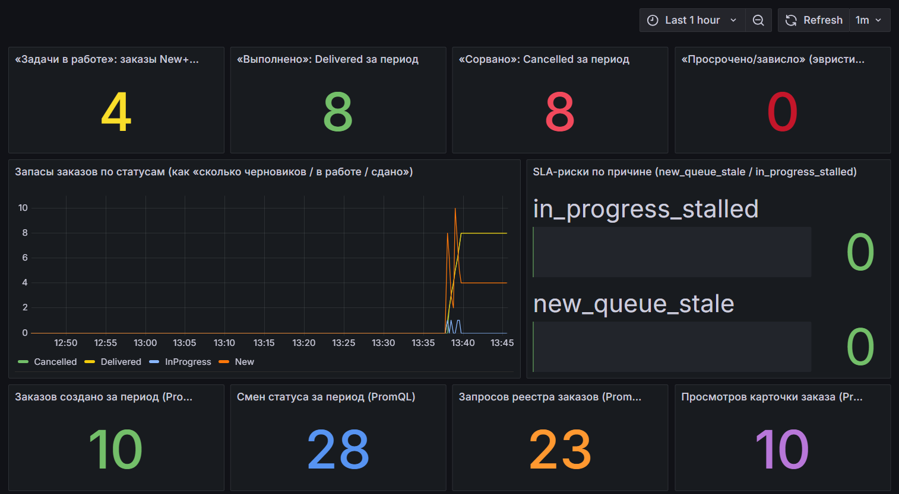
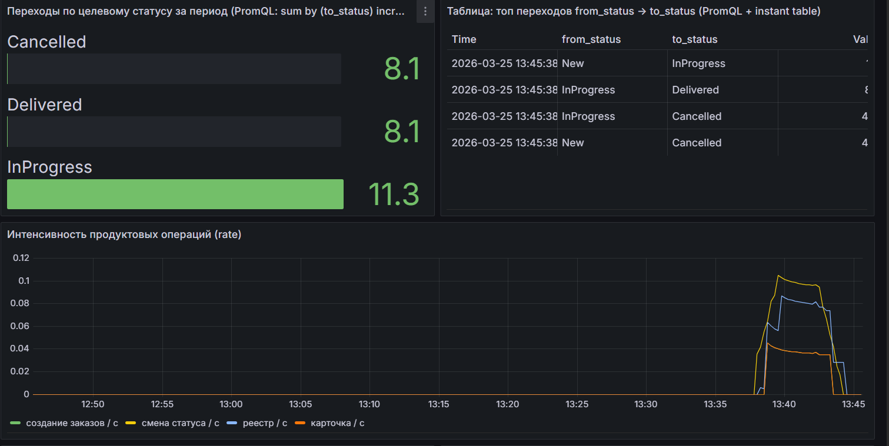
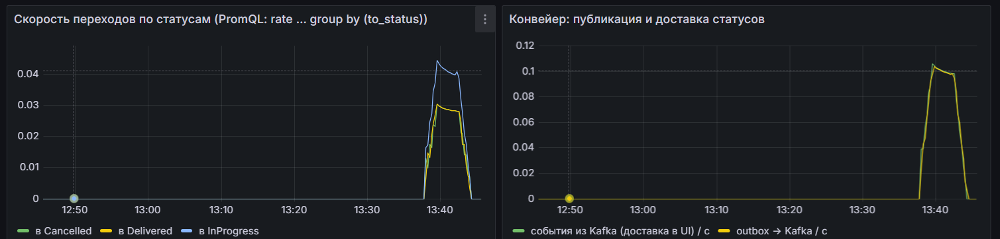
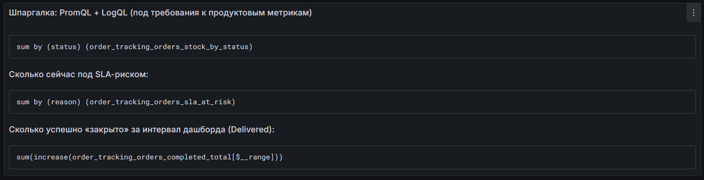
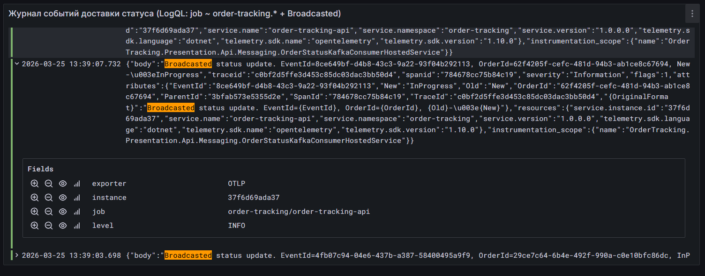

# Grafana: дашборд продуктовых метрик Order Tracking

Дашборд **«Order tracking — продуктовые метрики и запросы»**: `deploy/observability/grafana/dashboards/order-tracking-metrics.json`. После provisioning в Grafana: http://localhost:13001, учётная запись `admin` / `admin`.

Ниже скриншоты и краткие пояснения к панелям.

---

## 1. Обзор: снимок очереди, накопления за период и операционная активность



**Верхний ряд** — числа за выбранный интервал и снимок по БД:

- **«Задачи в работе»** — заказы в **New** и **InProgress**
- **«Выполнено»** — прирост счётчика **Delivered** за период
- **«Сорвано»** — то же для **Cancelled**.
- **«Просрочено/зависло»** — эвристика SLA: **New** старше 24 ч, **InProgress** без движения дольше 72 ч.

**График «Запасы заказов по статусам»** — во времени: сколько заказов в каждом статусе по данным опроса БД.

**«SLA-риски по причине»** — `new_queue_stale` и `in_progress_stalled`; нули означают, что пороги 24 ч / 72 ч не сработали.

**Нижний ряд** — счётчики из Prometheus, `increase` за `$__range`:

- **Заказов создано**
- **Смен статуса** — сумма переходов по парам `from_status` → `to_status`
- **Запросов реестра** — `GET /api/orders`
- **Просмотров карточки** — `GET /api/orders/{id}`

---

## 2. Воронка переходов и интенсивность операций (rate)



**Баргейдж «Переходы по целевому статусу»** — за интервал: переходы в **InProgress**, **Delivered**, **Cancelled**, `sum by (to_status)` от `increase`.

**Таблица топовых переходов** — **from_status → to_status** и сверка с правилами доменной модели.

**График «Интенсивность продуктовых операций (rate)»** — `rate(...[5m])` по созданию, смене статуса, реестру и карточке.

---

## 3. Скорость переходов по статусам и конвейер outbox → Kafka → UI



**«Скорость переходов по статусам»** — `rate` переходов по **to_status**.

**«Конвейер: публикация и доставка статусов»:**

- **outbox → Kafka** — публикация из worker
- **события из Kafka (доставка в UI)** — потребление в API и рассылка в SignalR

**«Надёжность outbox»** на дашборде — ошибки публикации и «ядро» outbox.

---

## 4. Шпаргалка PromQL + LogQL + LogsQL + OpenSearch на дашборде



**Текстовая** панель: **PromQL**, **LogQL**, **LogsQL**, **Lucene** и **DQL**, пайплайн OTLP → collector → три бэкенда. Полный текст в JSON дашборда; развёрнуто в **[logs-query-languages.md](logs-query-languages.md)**.

---

## 5. Loki: логи «Broadcasted» (доставка статуса в UI)



Логи **Information** из API: consumer обработал смену статуса и сделал **broadcast** в SignalR.

OTLP-логи в Loki с лейблом **`job`**, например `order-tracking/order-tracking-api`, не **`service_name`**. Пример панели:

```logql
{job=~"order-tracking.*"} |= "Broadcasted"
```

В развёрнутой строке: **тело**, **OrderId**, **Old/New**, трейс, scope **`OrderStatusKafkaConsumerHostedService`**. Цепочка: Kafka → API → клиенты.

---

## 6. Три колонки логов: Loki, VictoriaLogs, OpenSearch


Внизу `order-tracking-metrics.json` — три панели **Logs** из одного OTLP-потока:

1. **Loki**, **LogQL**: `{job=~"order-tracking.*"} |= "Broadcasted"`.
2. **VictoriaLogs**, **LogsQL**: `{service.name=~"order-tracking.*"} Broadcasted`. Нужен плагин `victoriametrics-logs-datasource` в Grafana.
3. **OpenSearch**, индекс `otel-logs*`, **Lucene** в Grafana, пример: `message:*Broadcasted* AND log.level:Information`. В **OpenSearch Dashboards** аналогичный фильтр — через **DQL**.

Подробнее — **[logs-query-languages.md](logs-query-languages.md)**.

---

## Запуск и проверка

1. `docker compose up -d`. При необходимости на **api** включён **DemoTraffic**.
2. Либо нагрузка API через `curl` или Swagger, см. корневой README.
3. В Grafana: **Last 15m** или **Last 1h**, обновление **10s** или **1m**. При первом старте Grafana дождаться установки плагина VictoriaLogs.
4. Prometheus скрейпит `api:8080/metrics` и `worker:9464/metrics`, см. `deploy/observability/prometheus.yml`.

У stat-панелей с `increase(...[$__range])` в JSON дашборда включены **instant**-запросы к Prometheus.
