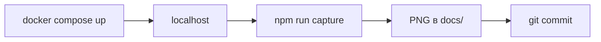

<div align="center">

## Скриншоты для документации

Съёмка **PNG** через Playwright (Chromium): одним запуском обновляются иллюстрации в [README.md](../README.md), [grafana-dashboard.md](../grafana-dashboard.md), [logs-query-languages.md](../logs-query-languages.md), [traces-jaeger.md](../traces-jaeger.md).

[](https://playwright.dev/)
[](../../frontend/.nvmrc)

База URL — **`127.0.0.1`** (или [`DOCS_SCREENSHOT_HOST`](#переменные-окружения)).

<br/>

</div>

> **Коротко:** `docker compose up -d` → на Windows **`tools/doc-screenshots/capture.cmd`** (ставит зависимости сам); вручную через npm — один раз **`npm run setup`**, затем **`npm run capture`** в `tools/doc-screenshots` → в индекс **`git add docs/`** (или в Git Bash — `git add docs/**/*.png`), коммит.

---

### Оглавление

| | |
|--|--|
| [Шпаргалка](#шпаргалка) | команды в одну строку |
| [Как устроено](#как-это-устроено) | поток и preflight |
| [Пример вывода](#пример-вывода) | что искать в консоли |
| [Коды выхода](#коды-выхода) | preflight, strict, ошибки |
| [Чеклист](#чеклист-перед-запуском) | до запуска скрипта |
| [Запуск](#запуск) | Windows и npm |
| [Переменные](#переменные-окружения) | env и CLI |
| [Порты](#порты) | хост → сервис |
| [Файлы на выходе](#файлы-на-выходе) | список PNG |
| [Проблемы](#если-что-то-не-так) | типичные сбои |

---

### Шпаргалка

| Нужно | Команда |
|--------|---------|
| Первый запуск вручную (npm) | **`npm run setup`** в `tools/doc-screenshots` — зависимости и Chromium; дальше достаточно **`npm run capture`** |
| Обычная съёмка | **`capture.cmd`** в `tools/doc-screenshots` или `npm run capture` там же |
| CI / «не молчи при нуле PNG» | **`capture.cmd strict`** · `npm run capture:strict` |
| Справка / версия | **`capture.cmd help`** · **`capture.cmd version`** или `node capture.mjs --help` |
| Видимый браузер | `capture.cmd headed` · `npm run capture:headed` |
| Preflight мешает | `npm run capture -- --skip-preflight` |

Одновременно видимый браузер и strict (из каталога `tools/doc-screenshots`): `npm run capture -- --headed --strict`.

---

### Как это устроено



1. **Preflight** — проверка `fetch` на `/health` и `/login`. Если **оба** недоступны — выход с подсказкой; один недоступен — предупреждение, съёмка продолжается.
2. Chromium открывает страницы и сохраняет фиксированные имена файлов под `docs/`.
3. В конце — счётчик файлов, пропусков, секунд. Полный успех — **до 16 PNG** (Swagger, Jaeger×3, Prometheus, frontend, OpenSearch, VictoriaLogs, Loki Explore, Grafana×6). Обычно **2–6 минут**, если все сервисы отвечают.

---

### Пример вывода

Строки **`OK  docs/...`** — файл записан; **`SKIP`** — страница не открылась (порт/таймаут). В конце:

```text
  OK  docs/openapi-docs.png
  SKIP VictoriaLogs: page.goto: Timeout 60000ms exceeded
  …
  Итого: снято файлов — 14, пропусков шагов — 2, время — 145.2s
```

Если нужно падать при **0** снятых файлов (например, в скрипте CI): `npm run capture:strict` или флаг **`--strict`**. Подробнее — [коды выхода](#коды-выхода).

---

### Коды выхода

| Код | Когда |
|-----|--------|
| **0** | Обычное завершение; при **`--strict`** — если записан **хотя бы один** PNG (даже при нескольких `SKIP`) |
| **1** | **Preflight:** оба проверяемых сервиса недоступны (ещё до браузера); **`--strict`** и **0** PNG; необработанное исключение или сбой Playwright |

Ошибка preflight с кодом **1** не обходится флагом **`--strict`** — только **`--skip-preflight`** (или поднятый стек).

---

### Чеклист перед запуском

| # | Действие |
|---|----------|
| 1 | `docker compose up -d` из корня репозитория |
| 2 | Первый подъём Grafana: **1–3 мин** (плагин VictoriaLogs) |
| 3 | Открываются в браузере: [5086/health](http://127.0.0.1:5086/health), [13001/login](http://127.0.0.1:13001/login) |
| 4 | Для трасс и графиков — **DemoTraffic** или запросы к API |

**Node ≥ 18** ([`frontend/.nvmrc`](../../frontend/.nvmrc), сейчас **22**).

---

### Запуск

#### Windows

Дважды **`capture.cmd`** в папке `tools/doc-screenshots`, либо:

```bat
cd /d путь\к\репозиторию\tools\doc-screenshots
capture.cmd
capture.cmd headed
capture.cmd strict
capture.cmd headed --skip-preflight
capture.cmd --skip-preflight
```

Батник делает `cd /d "%~dp0"` — кириллица в пути не ломает запуск. Дальше каждый раз: `npm install` → Chromium → `npm run capture` (по смыслу то же, что **`npm run setup`** при ручном запуске npm).

#### npm / PowerShell (macOS / Linux / вручную)

```powershell
cd tools/doc-screenshots
npm run setup
npm run capture
```

Из **корня** (первый раз — ставит зависимости и Chromium, затем съёмка):

```powershell
npm run setup --prefix tools/doc-screenshots; npm run capture --prefix tools/doc-screenshots
```

Повторные прогоны: достаточно `npm run capture --prefix tools/doc-screenshots`, если `node_modules` и браузер уже стоят.

Видимое окно: `npm run capture:headed` или `DOCS_CAPTURE_HEADED=1 npm run capture`. Обход preflight: `npm run capture -- --skip-preflight`. Строгий режим (ошибка при 0 PNG): `npm run capture:strict` или `npm run capture -- --strict`.

---

### Переменные окружения

| Переменная | По умолчанию | Назначение |
|------------|----------------|------------|
| `DOCS_SCREENSHOT_HOST` | `http://127.0.0.1` | База без порта |
| `GRAFANA_USER` / `GRAFANA_PASSWORD` | `admin` / `admin` | вход в Grafana |
| `DOCS_CAPTURE_HEADED` | *(выкл)* | как `capture:headed` |
| `DOCS_CAPTURE_STRICT` | *(выкл)* | `1` — ошибка, если **0** PNG (то же, что **`--strict`**) |

Смена **`DOCS_SCREENSHOT_HOST`** (другая машина, проброс портов): значение должно совпадать с тем URL, по которому страницы реально открываются в браузере (и для `fetch` в preflight).

**Справка (`--help`):** в конце вывода — абсолютные пути к корню репозитория и к файлу **`docs/screenshots/README.md`**.

**Флаги:** `--headed`, `--strict`, `--skip-preflight`, `--version` / `-V`. Неизвестные `-флаги` — предупреждение.

---

### Порты

Сервисы и порты на хосте (совпадают с [`docker-compose.yml`](../../docker-compose.yml) и разделом **«Запуск»** в [корневом README](../README.md)):

| Порт | Назначение |
|------|------------|
| **5086** | API (Swagger, `/health`) |
| **5173** | Frontend (Vite) |
| **9090** | Prometheus |
| **9428** | VictoriaLogs |
| **5601** | OpenSearch Dashboards |
| **13001** | Grafana |
| **16686** | Jaeger UI |

Скрипт обращается ко всем перечисленным портам при полном прогоне.

---

### Файлы на выходе

Имена PNG фиксированы — markdown ссылается только на **`.png`**. После прогона:

```bash
git add docs/**/*.png
git status
```

Проверить, что все ожидаемые файлы записаны (список совпадает с `capture.mjs`): из корня репозитория **`node scripts/verify-docs-assets.mjs`** (код **1**, если чего-то не хватает).

В **PowerShell** glob `**` может не раскрыться — можно так: `git add docs/` или перечислить каталоги (`docs/screenshots`, `docs/grafana`).

Проверь превью (GitHub или IDE), затем коммит.

<details>
<summary><strong>Список генерируемых PNG</strong></summary>

| Файл | Документ |
|------|----------|
| `docs/screenshots/frontend-app.png` | [README.md](../README.md) |
| `docs/screenshots/prometheus-graph.png` | [README.md](../README.md) |
| `docs/screenshots/loki-explore.png` | [logs-query-languages.md](../logs-query-languages.md) |
| `docs/screenshots/victorialogs-query.png` | [logs-query-languages.md](../logs-query-languages.md) |
| `docs/screenshots/opensearch-discover.png` | [logs-query-languages.md](../logs-query-languages.md) |
| `docs/screenshots/jaeger-search.png` | [traces-jaeger.md](../traces-jaeger.md) |
| `docs/screenshots/jaeger-trace-detail.png` | [traces-jaeger.md](../traces-jaeger.md) |
| `docs/openapi-docs.png`, `docs/jaeger-ui.png` | [README.md](../README.md) |
| `docs/grafana/01-dashboard-overview.png` … `06-three-log-columns.png` | [grafana-dashboard.md](../grafana-dashboard.md) |

</details>

| Артефакт | Путь |
|----------|------|
| Логика | [`capture.mjs`](../../tools/doc-screenshots/capture.mjs) |
| Windows | [`capture.cmd`](../../tools/doc-screenshots/capture.cmd) |
| npm | [`package.json`](../../tools/doc-screenshots/package.json) — скрипты `setup`, `capture`, `capture:headed`, `capture:strict`, `help` |

---

### Если что-то не так

| Симптом | Что сделать |
|---------|-------------|
| Сразу ошибка про `docker compose` | Стек не поднят или порты не на хосте |
| «Ни один ключевой сервис не ответил», fetch не видит localhost | **Preflight** — подними стек, проверь порты; при необходимости **`npm run capture -- --skip-preflight`** |
| Много `SKIP` / мало файлов | `docker compose ps` — сервис не в `running` или порт занят другим процессом |
| Grafana пустая на скрине | Подождать загрузки UI; первый старт дольше |
| Два одинаковых кадра Jaeger | Нет трасс — DemoTraffic или запросы к API |
| Падает `npm` / Playwright | Node ≥ 18, место на диске (~300 MB Chromium), антивирус; **`npm run setup`** в `tools/doc-screenshots`; на Linux при отсутствии библиотек: `npx playwright install chromium --with-deps` |
| Нужно видеть браузер | `capture.cmd headed` |
| На GitHub не видно PNG | Файлы не в коммите — переснять и **`git add docs/`** (см. выше) |
| Exit **1** при **`--strict`**, файлов **0** | См. [коды выхода](#коды-выхода); для отладки временно без **`--strict`** или с **`--skip-preflight`** |
