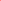

# Трейсы: OpenTelemetry, OTLP, Jaeger

Цепочка: приложение генерирует спаны через **OpenTelemetry**, экспортирует их по **OTLP** в **otel-collector**, коллектор отправляет трассировки в **Jaeger**.

---

## 1. Где это в коде

| Компонент | Файл |
|-----------|------|
| Источник активностей | `OrderTracking.Infrastructure.Observability.Telemetry.ActivitySource` (`ActivitySourceName` = `OrderTracking`) |
| Регистрация трассировки API | `src/OrderTracking.Presentation.Api/Program.cs` — `AddOpenTelemetry().WithTracing(...)`, автоматические инструменты ASP.NET Core, HTTP, EF Core |
| Регистрация Worker | `src/OrderTracking.Presentation.Worker/Program.cs` — то же для worker-процесса |
| Ручные спаны | вызовы `Telemetry.ActivitySource.StartActivity(...)` в доменных участках: outbox, Kafka, SignalR |

Пайплайн коллектора: `deploy/observability/otel-collector-config.yml`, секция `traces` → экспортёр `otlp/jaeger` на `jaeger:4317`.

---

## 2. Отправка и хранение

- Протокол: **OTLP** по gRPC на коллектор `4317`.
- Jaeger в compose принимает OTLP и показывает UI на **http://localhost:16686**.
- Сервисы в интерфейсе: **`order-tracking-api`**, **`order-tracking-worker`** — совпадают с `OpenTelemetry:ServiceName` в конфигурации.

---

## 3. Просмотр и «язык запросов» в Jaeger

Jaeger не использует отдельный SQL-подобный язык: фильтрация строится из **UI** и **тегов спанов**.

Обычный сценарий:

1. Service — выбрать `order-tracking-api` или `order-tracking-worker`.
2. Lookback — интервал времени.
3. Find Traces — список трасс.

Уточнение поиска:

- **Tags** в форме поиска — пары `ключ=значение`, например стандартные семантические теги OpenTelemetry: `http.route`, `http.status_code`, `db.system`.
- Теги домена в этом проекте (можно подставлять в Jaeger Search → Tags):  
  `order.id`, `integration.event_id`, `kafka.topic`, `messaging.destination`, `signalr.event`.
- **Min Duration** — отсечь короткие запросы.
- **Limit** — ограничить число результатов.

Имена пользовательских спанов в коде:

| Имя спана | Где |
|-----------|-----|
| `Outbox.Dispatch` | Worker, выгрузка outbox |
| `Kafka.Produce` | Worker, публикация в Kafka |
| `Kafka.Consume` | API, потребление статуса из Kafka |
| `SignalR.Broadcast` | API, рассылка клиентам |

Открытая трассировка: дерево спанов, длительности, ошибки. Идентификатор трассы (**Trace ID**) можно скопировать для сопоставления с логами.

---

## 4. Связь логов и трейсов

При включённом OTLP-логировании провайдер обычно добавляет в контекст записи лога идентификаторы **`trace_id`** и **`span_id`** в том виде, как их сериализует экспортёр в Loki / OpenSearch / VictoriaLogs.

Практическая проверка:

1. Найти трейс в Jaeger и скопировать **Trace ID**.
2. В Grafana Loki или OpenSearch выполнить поиск по подстроке этого UUID в теле лога или по полю, если индексатор выделил его отдельно.

Подробнее про поля логов: [logs-query-languages.md](logs-query-languages.md).

---

## 5. Конфигурация для compose

Переменные окружения API/Worker:

- `OpenTelemetry__Otlp__Endpoint=http://otel-collector:4317`
- `OpenTelemetry__Exporters__Otlp=true`

Локально без compose endpoint по умолчанию из `appsettings`: `http://localhost:4317`.
